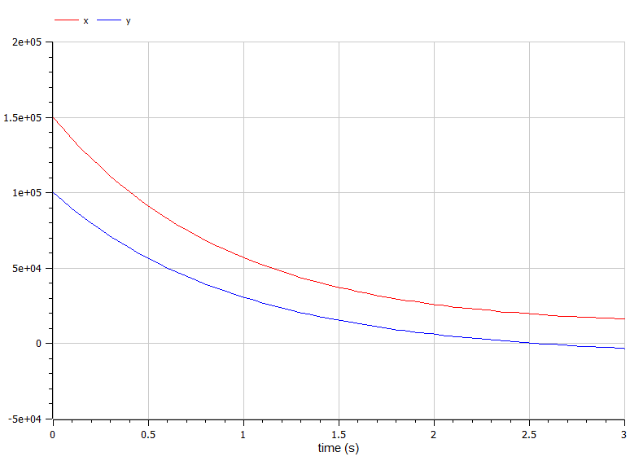
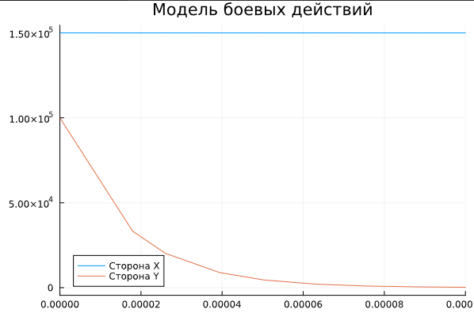

---
## Front matter
lang: ru-RU
title: Лабораторная работа № 3
subtitle: Модель боевых действий
author: Артамонов Тимофей Евгеньевич

## Formatting
toc: false
slide_level: 2
theme: metropolis
header-includes: 
 - \metroset{progressbar=frametitle,sectionpage=progressbar,numbering=fraction}
 - '\makeatletter'
 - '\beamer@ignorenonframefalse'
 - '\makeatother'
aspectratio: 43
section-titles: true
---

# Цели работы

* Рассмотреть модели Ланчестера и научиться их строить
* Написать аналог программы на языке OpenModelica

# Постановка задачи

Между страной Х и страной У идет война. Численность состава войск исчисляется от начала войны, 
и являются временными функциями x(t) и y(t). В начальный момент времени страна Х имеет армию 
численностью 150 000 человек, а в распоряжении страны У армия численностью в 100 000 человек. 
Для упрощения модели считаем, что коэффициенты, 

## Вариант 1					

| Коэффициенты при x(t) | Коэффициенты при y(t) |
|-----------------------|-----------------------|
| a = 0.45    		| b = 0.85   		|
| c = 0.45    		| h = 0.45   		|

и функции
P(t) = sin(t+8) + 1 
Q(t) = cos(t+8) + 1

## Вариант 2					

| Коэффициенты при x(t) | Коэффициенты при y(t) |
|-----------------------|-----------------------|
| a = 0.31    		| b = 0.79   		|
| c = 0.41    		| h = 0.32   		|

P(t) = 2sin(t)
Q(t) = 2cos(t) - постоянны и непрерывны соответственно.

# Задачи

1. Постройте графики изменения численности войск армии Х и армии У для Модели боевых действий 
между регулярными войсками
2. Постройте графики изменения численности войск армии Х и армии У для Модели ведения боевых 
действий с участием регулярных войск и
партизанских отрядов
3. Построить графики на языках Julia и OpenModelica
4. Сравнить результаты

# Выполнение работы

Возьмём код из примера лабораторной работы на SciLab и запишем его на языках Julia и OpenModelica.
Подставим по очереди свои значения для обоих вариантов(для сражения регулярных войск и сражения 
регулярных войск с участием партизанских войск. Сравним получившиеся графики.

## Сражение регулярных войск на яхыке Julia (рис. [-@fig:001])

{ #fig:001 width=70% }

## Сражение регулярных войск на яхыке OpenModelica (рис. [-@fig:002])

{ #fig:002 width=70% }

Видно, что графики примерно одинаковые.

## Сражение регулярных войск c участием партизанских отрядов на яхыке Julia (рис. [-@fig:003])

{ #fig:003 width=70% }

## Сражение регулярных войск c участием партизанских отрядов на яхыке OpenModelica (рис. [-@fig:004])

{ #fig:004 width=70% }

Пришлось для обоих случаев изменить разбиение участка и сильно приблизить график, видно что в OMEdit сторона Y проиграла сражение уже через 0.1 секунду.
Так же можно заметить, что в OMEdit график плавнее. Это может значить, что либо выбрана не самая удачная функция на языке Julia, либо что выбран плохой интервал сохранения значений.

# Вывод

Построили модели боевых действия для 2 случаев на 2 языках. Выяснили, что на OpenModelica графики точнее. Познакомились и научились строить модели боевых действий.

