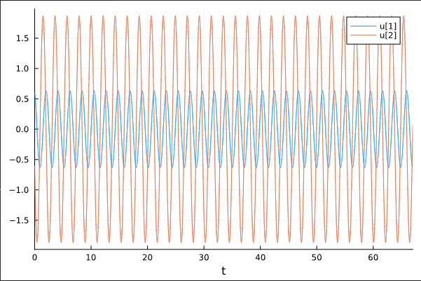
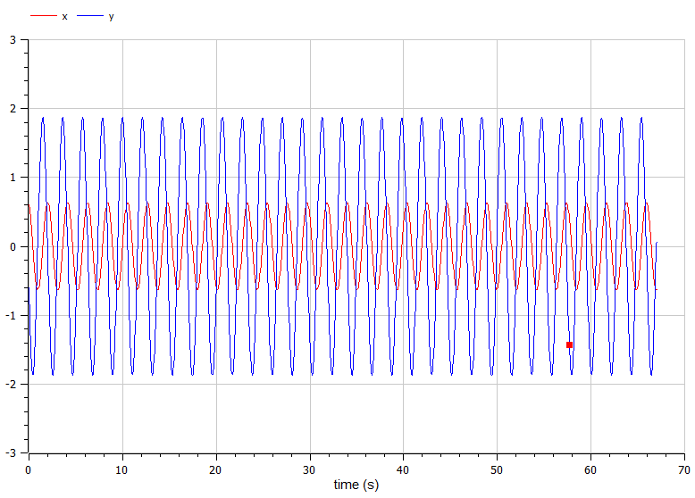
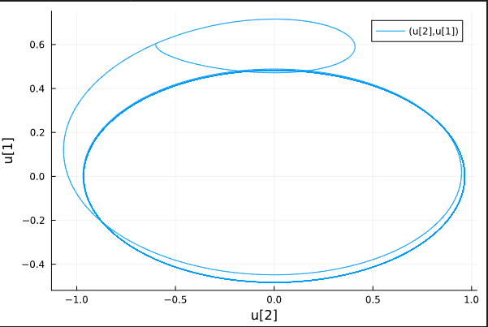

---
## Front matter
lang: ru-RU
title: Лабораторная работа № 4
subtitle: Модель гармонических колебаний
author: Артамонов Тимофей Евгеньевич

## Formatting
toc: false
slide_level: 2
theme: metropolis
header-includes: 
 - \metroset{progressbar=frametitle,sectionpage=progressbar,numbering=fraction}
 - '\makeatletter'
 - '\beamer@ignorenonframefalse'
 - '\makeatother'
aspectratio: 43
section-titles: true
---

# Цель работы

- Построить решение уравнения гармонического осциллятора для разных случаев:
  - без затухания и внешней силы,
  - с затуханием без внешней силы
  - с затуханием и внешней силой
- Построить фазовые портреты для каждого случая

# Теоретическое введение

Гармонические колебания — колебания, при которых физическая величина изменяется 
с течением времени по гармоническому (синусоидальному, косинусоидальному) закону. 

Осциллятор — система, совершающая колебания, то есть показатели которой периодически повторяются во времени. 
Примеры простейших осцилляторов — маятник и колебательный контур. 

## Теоретическое введение

Уравнение свободных колебаний гармонического осциллятора имеет следующий вид:
$$
\ddot{x} + 2\gamma \dot{x} + \omega^2 x = 0,
$$
где x – переменная, описывающая состояние системы (смещение грузика, заряд конденсатора и т.д.), 
$\gamma$ – параметр, характеризующий потери энергии (трение в механической системе, сопротивление в контуре),
$\omega^2$ – собственная частота колебаний, t – время.

## Теоретическое введение

При отсутствии потерь в системе ($\gamma = 0$) вместо первого уравнения получаем уравнение консервативного 
осциллятора энергия колебания которого сохраняется во времени:
$$
\ddot{x} + \omega^2 x = 0
$$

## Теоретическое введение

Для однозначной разрешимости уравнения второго порядка (2) необходимо задать два начальных условия вида:
$$
\begin{cases}
    x(t_0) = x_0, \\ 
    \dot{x(t_0)} = y_0.
\end{cases}
$$

## Теоретическое введение
Также может появится внешняя сила, действующая на осциллятор, в этом случае уравнение примет вид:

$$
\ddot{x} + 2\gamma \dot{x} + \omega^2 x = \F(t),
$$
где $F(t)$ - внешняя сила.

# Постановка задачи

1. Построить решение уравнения гармонического осциллятора без затухания. Построить фазовый портрет.
2. Записать уравнение свободных колебаний гармонического осциллятора с затуханием, построить его решение.
Построить фазовый портрет гармонических колебаний с затуханием.
3. Записать уравнение колебаний гармонического осциллятора, если на систему действует внешняя сила, 
построить его решение. Построить фазовый портрет колебаний с действием внешней силы.

# Задачи

Постройте фазовый портрет гармонического осциллятора и решение уравнения гармонического осциллятора для следующих случаев:

1. Колебания гармонического осциллятора без затуханий и без действий внешней силы
$$
\ddot{x} + 8.7x = 0
$$
2. Колебания гармонического осциллятора c затуханием и без действий внешней силы
$$
\ddot{x} + 8.7\dot{x} + 8.7x = 0
$$
3. Колебания гармонического осциллятора c затуханием и под действием внешней силы
$$
\ddot{x} + 8.7 \dot{x} + 8.7 x = 8.7 \sin(2t)
$$
На интервале t = (0; 67) (шаг 0.05) с начальными условиями $x_0 = 0.6, y_0 = -0.6$

# Выполнение работы

# Написали код на Julia и OpenModelica и получили следующие графики.

## Построили график решения осциллятора без затуханий и внешней силы на Julia. (рис. [-@fig:001])

{ #fig:001 width=70% }

## Построили фазовый портерт на Julia. (рис. [-@fig:002])

{ #fig:002 width=70% }

## Построили график решения осциллятора на OpenModelica. (рис. [-@fig:003])

{ #fig:003 width=70% }

## Построили фазовый портерт на OpenModelica. (рис. [-@fig:004])

{ #fig:004 width=70% }

## Построили график решения осциллятора с затуханием без внешней силы на Julia. (рис. [-@fig:005])

{ #fig:005 width=70% }

## Построили фазовый портерт на Julia. (рис. [-@fig:006])

{ #fig:006 width=70% }

## Построили график решения осциллятора на OpenModelica. (рис. [-@fig:007])

{ #fig:007 width=70% }

## Построили фазовый портерт на OpenModelica. (рис. [-@fig:008])

{ #fig:008 width=70% }

## Построили график решения осциллятора с затуханием и внешней силой на Julia. (рис. [-@fig:009])

{ #fig:009 width=70% }

## Построили фазовый портерт на Julia. (рис. [-@fig:010])

{ #fig:010 width=70% }

## Построили график решения осциллятора на OpenModelica. (рис. [-@fig:007])

{ #fig:007 width=70% }

## Построили фазовый портерт на OpenModelica. (рис. [-@fig:008])

{ #fig:008 width=70% }

# Выводы

Построили графики решения гармонического осциллятора а так же их фазовые портреты для 3 разных случаев:
- без затухания и действия внешних сил
- с затуханием и без действия внешних сил
- с затуханием и действием внешних сил
