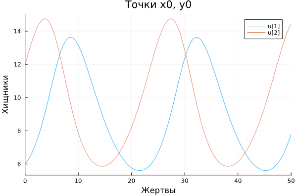
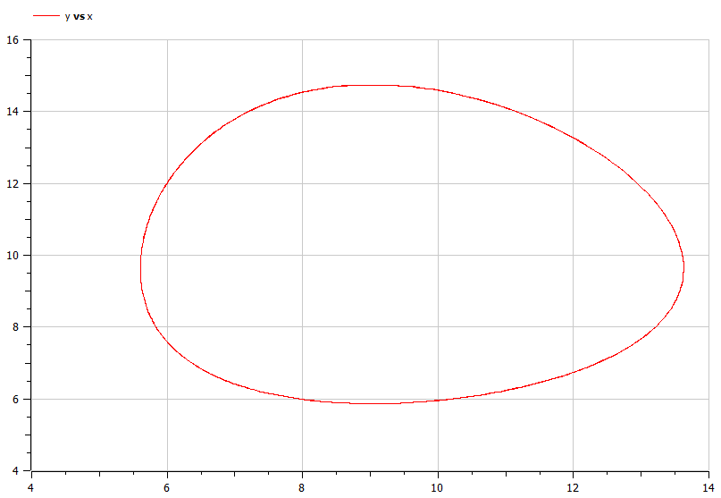
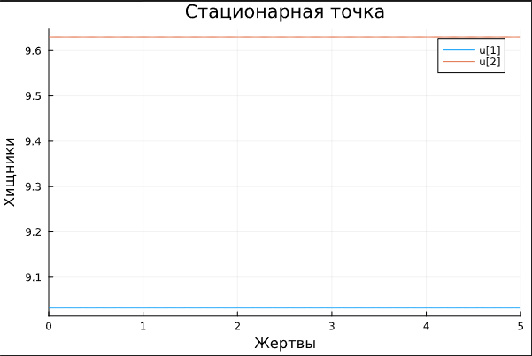
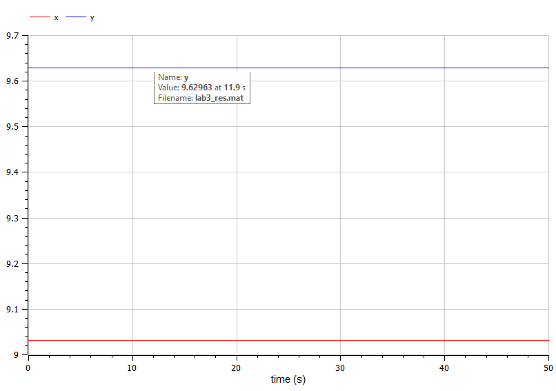

---
## Front matter
title: "Отчёт по лабораторной работе №5"
subtitle: "Модель хищник-жертва"
author: "Артамонов Тимофей Евгеньевич"

## Generic otions
lang: ru-RU
toc-title: "Содержание"

## Bibliography
bibliography: bib/cite.bib
csl: pandoc/csl/gost-r-7-0-5-2008-numeric.csl

## Pdf output format
toc: true # Table of contents
toc-depth: 2
lof: true # List of figures
lot: true # List of tables
fontsize: 12pt
linestretch: 1.5
papersize: a4
documentclass: scrreprt
## I18n polyglossia
polyglossia-lang:
  name: russian
  options:
	- spelling=modern
	- babelshorthands=true
polyglossia-otherlangs:
  name: english
## I18n babel
babel-lang: russian
babel-otherlangs: english
## Fonts
mainfont: PT Serif
romanfont: PT Serif
sansfont: PT Sans
monofont: PT Mono
mainfontoptions: Ligatures=TeX
romanfontoptions: Ligatures=TeX
sansfontoptions: Ligatures=TeX,Scale=MatchLowercase
monofontoptions: Scale=MatchLowercase,Scale=0.9
## Biblatex
biblatex: true
biblio-style: "gost-numeric"
biblatexoptions:
  - parentracker=true
  - backend=biber
  - hyperref=auto
  - language=auto
  - autolang=other*
  - citestyle=gost-numeric
## Pandoc-crossref LaTeX customization
figureTitle: "Рис."
tableTitle: "Таблица"
listingTitle: "Листинг"
lofTitle: "Список иллюстраций"
lotTitle: "Список таблиц"
lolTitle: "Листинги"
## Misc options
indent: true
header-includes:
  - \usepackage{indentfirst}
  - \usepackage{float} # keep figures where there are in the text
  - \floatplacement{figure}{H} # keep figures where there are in the text
---

# Цель работы

- Построить график зависимости численности хищников от численности жертв, а также графики изменения численности хищников и численности жертв при
следующих начальных условиях: $x_0 = 6$, $y_0 = 12$.
- Найти стационарное состояние системы.
  
# Теоретическое введение

Моде́ль Лотки — Вольтерры — модель взаимодействия двух видов типа «хищник — жертва», названная в честь своих авторов (Лотка, 1925; Вольтерра 1926), 
которые предложили модельные уравнения независимо друг от друга.
Такие уравнения можно использовать для моделирования систем «хищник — жертва», «паразит — хозяин», 
конкуренции и других видов взаимодействия между двумя видами. [@wiki:bash]

Простейшая модель взаимодействия двух видов типа «хищник — жертва» - модель Лотки-Вольтерры. Данная двувидовая модель основывается на
следующих предположениях:
1. Численность популяции жертв x и хищников y зависят только от времени 
(модель не учитывает пространственное распределение популяции на занимаемой территории)
2. В отсутствии взаимодействия численность видов изменяется по модели Мальтуса, при этом число жертв увеличивается, а число хищников падает
3. Естественная смертность жертвы и естественная рождаемость хищника считаются несущественными
4. Эффект насыщения численности обеих популяций не учитывается
5. Скорость роста численности жертв уменьшается пропорционально численности хищников
$$
\frac{dx}{dt} = ax(t) - bx(t)y(t) \\
\frac{dy}{dt} = -cy(t) + dx(t)y(t)
$$
В этой модели $x$ – число жертв, $y$ - число хищников. Коэффициент $a$ описывает скорость естественного прироста
числа жертв в отсутствие хищников, $с$ - естественное вымирание хищников, лишенных пищи в виде жертв. Вероятность
взаимодействия жертвы и хищника считается пропорциональной как количеству жертв, так и числу самих хищников ($xy$).
Каждый акт взаимодействия уменьшает популяцию жертв, но способствует увеличению популяции хищников (члены $-bxy$
и $dxy$ в правой части уравнения).

Математический анализ этой (жесткой) модели показывает, что имеется стационарное состояние (A), 
всякое же другое начальное состояние (B) приводит к периодическому колебанию численности как жертв, так и хищников,
так что по прошествии некоторого времени система возвращается в состояние B. Стационарное состояние системы
(положение равновесия, не зависящее от времени решение) будет в точке 
$x_0 = \frac{c}{d}$
$y_0 = \frac{a}{b}$
Если начальные значения задать в стационарном состоянии $x(0) = x_0$, $y(0) = y_0$ , то в любой момент времени
численность популяций изменяться не будет

Независимые переменные x, y определяют пространство, в котором «движется» решение. 
Это фазовое пространство системы, поскольку оно двумерно будем называть его фазовой плоскостью.
Значение фазовых координат x, y в любой момент времени полностью определяет состояние системы. 
Решению уравнения движения как функции времени отвечает гладкая кривая в фазовой плоскости. 
Она называется фазовой траекторией. Если множество различных решений (соответствующих различным
начальным условиям) изобразить на одной фазовой плоскости, возникает общая картина поведения системы. 
Такую картину, образованную набором фазовых траекторий, называют фазовым портретом.

# Постановка задачи

Модель «хищник-жертва»:
$$
\frac{dx}{dt} = -0.26x(t) + 0.027x(t)y(t) \\
\frac{dy}{dt} = 0.28y(t) - 0.031x(t)y(t)
$$
В этой модели $x$ – число жертв, $y$ - число хищников.


# Задание 

Постройте график зависимости численности хищников от численности жертв, а также графики изменения численности хищников и численности жертв при
следующих начальных условиях: $x_0 = 6$, $y_0 = 12$. Найдите стационарное состояние системы.


# Выполнение лабораторной работы

Написали код на Julia:
```julia

using DifferentialEquations, Plots, OrdinaryDiffEq


function lotka_volterr(u, p, t)
    x, y = u
    a, b, c, d = p
    dx = -a*x + b*x*y
    dy = c*y - d*x*y
    return [dx, dy]
end

#Начальные условия
p = [0.26, 0.027, 0.28, 0.031] 
x0 = 6
y0 = 12
tspan = (0, 50)

#Стационарная точка
y1 = p[1]/p[2]
x1 = p[3]/p[4]


prob1 = ODEProblem(lotka_volterr, [x0, y0], tspan, p)
prob2 = ODEProblem(lotka_volterr, [x1, y1], tspan, p)

sol1 = solve(prob1, Tsit5(), dtmax = 0.05)
sol2 = solve(prob2, Tsit5(), dtmax = 0.05)
plot(sol1, title = "Точки x0, y0") # График колебаний
#plot(sol1, vars = (2, 1), title = "Точки x0, y0") #Фазовый портрет
#plot(sol2, title = "Стационарная точка") # График колебаний
#scatter(sol2, vars = (2, 1), markersize=[20], title = "Стационарная точка") #Фазовый портрет
xlabel!("Жертвы")
ylabel!("Хищники")
#xlims!(9, 10)
#ylims!(8, 10)
```

Записали 2 случая на языке OpenModelica 
```
model lab5

parameter Real a = 0.26;
parameter Real b = 0.027;
parameter Real c = 0.28;
parameter Real d = 0.031;

Real x(start = 6);
Real y(start = 12);

equation
  der(x) = -a*x + b*x*y;
  der(y) = c*y - d*x*y;

  
end lab5;
```
```
model lab5

parameter Real a = 0.26;
parameter Real b = 0.027;
parameter Real c = 0.28;
parameter Real d = 0.031;

Real x(start = c/d);
Real y(start = a/b);

equation
  der(x) = -a*x + b*x*y;
  der(y) = c*y - d*x*y;

  
end lab5;
```

и получили следующие результаты.

## Построили график колебаний популяции хищников и жертв на Julia в точке $x_0$, $y_0$. (рис. [-@fig:001])

{ #fig:001 width=70% }

## Построили график на OpenModelica, графики одинаковые (рис. [-@fig:002])

{ #fig:002 width=70% }

## Построили фазовый портерт на Julia. (рис. [-@fig:003])

{ #fig:003 width=70% }

## Построили фазовый портерт на OpenModelica, фазовые портреты одинаковые. (рис. [-@fig:004])

{ #fig:004 width=70% }

## Построили график изменения популяции хищников и жертв в стационарной точке. (рис. [-@fig:005])

{ #fig:005 width=70% }

## Построили график на OpenModelica, графики одинаковые. (рис. [-@fig:006])

{ #fig:006 width=70% }

## Построили фазовый портерт в стационарной точке на Julia. (рис. [-@fig:007])

{ #fig:007 width=70% }

##Построили фазовый портерт на OpenModelica. (рис. [-@fig:008])

{ #fig:008 width=70% }


# Выводы

- Построили график зависимости численности хищников от численности жертв, а также графики изменения численности хищников и численности жертв при
следующих начальных условиях: $x_0 = 6$, $y_0 = 12$.
- Нашли стационарное состояние системы.
- Сравнили результаты на Julia и OpenModelica.

# Список литературы{.unnumbered}

::: {#refs}
:::
