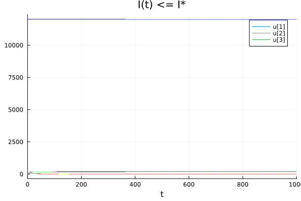
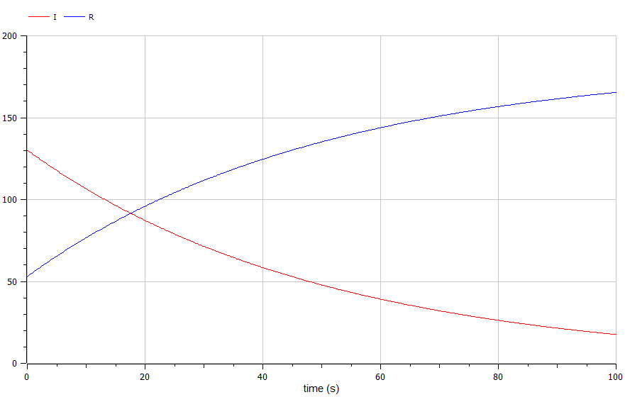

---
## Front matter
title: "Отчёт по лабораторной работе №6"
subtitle: "Задача об эпидемии"
author: "Артамонов Тимофей Евгеньевич"

## Generic otions
lang: ru-RU
toc-title: "Содержание"

## Bibliography
bibliography: bib/cite.bib
csl: pandoc/csl/gost-r-7-0-5-2008-numeric.csl

## Pdf output format
toc: true # Table of contents
toc-depth: 2
lof: true # List of figures
lot: true # List of tables
fontsize: 12pt
linestretch: 1.5
papersize: a4
documentclass: scrreprt
## I18n polyglossia
polyglossia-lang:
  name: russian
  options:
	- spelling=modern
	- babelshorthands=true
polyglossia-otherlangs:
  name: english
## I18n babel
babel-lang: russian
babel-otherlangs: english
## Fonts
mainfont: PT Serif
romanfont: PT Serif
sansfont: PT Sans
monofont: PT Mono
mainfontoptions: Ligatures=TeX
romanfontoptions: Ligatures=TeX
sansfontoptions: Ligatures=TeX,Scale=MatchLowercase
monofontoptions: Scale=MatchLowercase,Scale=0.9
## Biblatex
biblatex: true
biblio-style: "gost-numeric"
biblatexoptions:
  - parentracker=true
  - backend=biber
  - hyperref=auto
  - language=auto
  - autolang=other*
  - citestyle=gost-numeric
## Pandoc-crossref LaTeX customization
figureTitle: "Рис."
tableTitle: "Таблица"
listingTitle: "Листинг"
lofTitle: "Список иллюстраций"
lotTitle: "Список таблиц"
lolTitle: "Листинги"
## Misc options
indent: true
header-includes:
  - \usepackage{indentfirst}
  - \usepackage{float} # keep figures where there are in the text
  - \floatplacement{figure}{H} # keep figures where there are in the text
---

# Цель работы

- Рассмотреть простейшую модель эпидемии.
- Построить графики изменения количества каждой группы для 2 случаев.
  
# Теоретическое введение

Компартментные модели — это очень общий метод моделирования. Их часто применяют для математического моделирования инфекционных заболеваний. 
Население распределяется по отсекам с метками, например, S , I или R (Восприимчивый, Инфекционный или Выздоровевший). 
Люди могут перемещаться между отсеками. Порядок меток обычно показывает структуру потока между отсеками; например, 
SEIS означает «восприимчивый», «разоблаченный», «заразный», а затем снова «восприимчивый».
Эта модель является достаточно прогностической для инфекционных заболеваний, которые передаются от человека к человеку 
и при которых выздоровление обеспечивает устойчивую устойчивость, таких как корь , эпидемический паротит и краснуха . [@wiki:bash]

Рассмотрим простейшую модель эпидемии. Предположим, что некая популяция, состоящая из N особей, (считаем, что популяция изолирована)
подразделяется на три группы. Первая группа - это восприимчивые к болезни, но пока здоровые особи, обозначим их через S(t). Вторая группа – это число
инфицированных особей, которые также при этом являются распространителями инфекции, обозначим их I(t). А третья группа, обозначающаяся через R(t) – это
здоровые особи с иммунитетом к болезни.

До того, как число заболевших не превышает критического значения I*, считаем, что все больные изолированы и не заражают здоровых. 
Когда $I(t) > I*$, тогда инфицирование способны заражать восприимчивых к болезни особей.

Таким образом, скорость изменения числа S(t) меняется по следующему закону:

$$
\frac{dS}{dt} = 
\begin{cases}
-\alpha S \textrm{, если  }I(t) > I* \\
0 \textrm{, если  } I(t) <= I*
\end{cases}
$$

I(t) меняется по следующему закону:

$$
\frac{dI}{dt} = 
\begin{cases}
\alpha S - \beta I \textrm{, если  }I(t) > I* \\
-\beta I \textrm{, если  } I(t) <= I*
\end{cases}
$$

R(t) меняется по следующему закону:
$\frac{dR}{dt} = \beta I$

Постоянные пропорциональности, $\alpha$, $\beta$ - это коэффициенты заболеваемости и выздоровления соответственно.

Будем считать, что начало эпидемии происходит в момент времени t = 0.

# Постановка задачи

На одном острове вспыхнула эпидемия. Известно, что из всех проживающих на острове (N = 12 200) в момент начала эпидемии (t=0) число заболевших людей
(являющихся распространителями инфекции) I(0) = 130, А число здоровых людей с иммунитетом к болезни R(0) = 53. Таким образом, число людей восприимчивых к
болезни, но пока здоровых, в начальный момент времени S(0) = N - I(0) - R(0).

# Задание 

Постройте графики изменения числа особей в каждой из трех групп. Рассмотрите, как будет протекать эпидемия в случае:
1) если I(0) > I*
2) если I(0) <= I*

# Выполнение лабораторной работы

Написали код на Julia:
```julia

using DifferentialEquations, Plots, OrdinaryDiffEq

#Функция описывающая изменения каждой группы, когда I(0) <= I* 
function noncrit!(du, u, p, t)
    a, b = p
    du[1] = 0
    du[2] = -b*u[2]
    du[3] = b*u[2]
end

#Функция описывающая изменения каждой группы, когда I(0) > I* 
function crit!(du, u, p, t)
    a, b = p
    du[1] = -a*u[1]
    du[2] = a*u[1] - b*u[2]
    du[3] = b*u[2]
end

#Начальные условия
N = 12200
p = [0.01, 0.02]
x0 = [N-130-53, 53, 130]
tspan = (0, 1000)


prob1 = ODEProblem(noncrit!, x0, tspan, p)
prob2 = ODEProblem(crit!, x0, tspan, p)

sol1 = solve(prob1, Tsit5(), dtmax = 0.05)
sol2 = solve(prob2, Tsit5(), dtmax = 0.05)

plot(sol1, title = "I(t) <= I*")
plot(sol2, title = "I(t) > I*")
```

Записали 2 случая на языке OpenModelica 
```
model lab6

parameter Real a = 0.01;
parameter Real b = 0.02;

Real S(start = 12200-130-53);
Real I(start = 130);
Real R(start = 53);

equation
  der(S) = 0;
  der(I) = -b*I;
  der(R) = b*I;

  
end lab6;
```
```
model lab6

parameter Real a = 0.01;
parameter Real b = 0.02;


Real S(start = 12200-130-53);
Real I(start = 130);
Real R(start = 53);

equation
  der(S) = -a*S;
  der(I) = a*S - b*I;
  der(R) = b*I;

  
end lab6;
```

и получили следующие результаты.

Построили график изменения групп S, I, R когда I(0) <= I* на Julia. (рис. [-@fig:001])

{#fig:001 width=70%}

Построили график на OpenModelica, графики одинаковые (рис. [-@fig:002])

{#fig:002 width=70%}

Можно построить отдельно I и R, чтобы лучше понять, что происходит. (рис. [-@fig:003])

{#fig:003 width=70%}

Построили график изменения групп S, I, R когда I(0) > I* на Julia. (рис. [-@fig:004])
Видно, что постепенно все люди заболевают, впоследствие приобретая иммунитет.

{#fig:004 width=70%}

Построили такой же график в OpenModelica (рис. [-@fig:005])

{#fig:005 width=70%}


# Выводы

- Построили графики изменения численности групп S, I, R для 2 случаев
- Сравнили результаты на Julia и OpenModelica.

# Список литературы{.unnumbered}

::: {#refs}
:::
