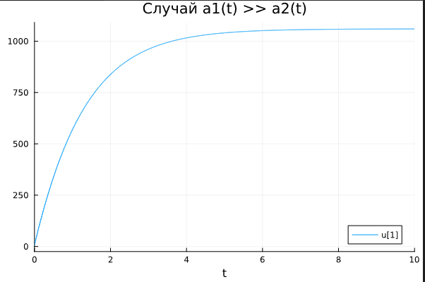
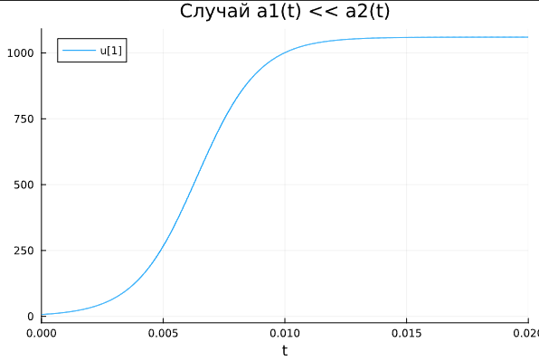
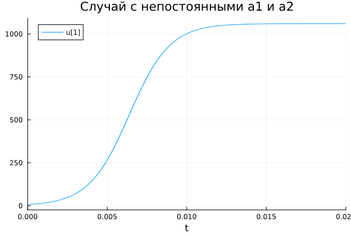

---
## Front matter
lang: ru-RU
title: Лабораторная работа № 7
subtitle: Эффективность рекламы
author:
  - Артамонов Т. Е.
institute:
  - Российский университет дружбы народов, Москва, Россия
date: 8 августа 2024

## i18n babel
babel-lang: russian
babel-otherlangs: english

## Formatting pdf
toc: false
toc-title: Содержание
slide_level: 2
aspectratio: 169
section-titles: true
theme: metropolis
header-includes:
 - \metroset{progressbar=frametitle,sectionpage=progressbar,numbering=fraction}
 - '\makeatletter'
 - '\beamer@ignorenonframefalse'
 - '\makeatother'
---

# Информация

## Докладчик

:::::::::::::: {.columns align=center}
::: {.column width="70%"}

  * Артамонов Тимофей Евгеньевич
  * студент группы НКНбд-01-21
  * Российский университет дружбы народов
  * <https://github.com/teartamonov>

:::
::: {.column width="30%"}

:::
::::::::::::::

# Введение

## Цель работы

- Рассмотреть модель рекламной кампании.
- Построить графики изменения количества клиентов для 3 случаев.
- Сравнить результаты на 2 языках программирования

## Теоретическое введение

Рекламная кампания — это целенаправленная система спланированных рекламных мероприятий, объединённых одной идеей и концепцией для достижения 
конкретной маркетинговой цели в рамках согласованной маркетинговой стратегии рекламодателя, в установленные предварительным анализом период времени, 
область действия, рынок и целевую аудиторию. 

Основными целями рекламных кампаний являются развитие у покупателей эффекта узнавания и припоминания товара, соответствующей степени 
информированности о продукции, положительного имиджа производителя (продавца), необходимости в приобретении продукции и увеличение 
спроса на продукцию, привлечение новых и одновременно удержание имеющихся потребителей. [@wiki:bash]

## Теоретическое введение

Организуется рекламная кампания нового товара или услуги. Необходимо, чтобы прибыль будущих продаж с избытком покрывала издержки на рекламу.
Вначале расходы могут превышать прибыль, поскольку лишь малая часть потенциальных покупателей будет информирована о новинке. 
Затем, при увеличении числа продаж, возрастает и прибыль, и, наконец, наступит момент, когда рынок насытиться, и рекламировать товар станет бесполезным.

## Теоретическое введение

Предположим, что торговыми учреждениями реализуется некоторая продукция, о которой в момент времениt из числа потенциальных покупателей $N$
знает лишь $n$ покупателей. Для ускорения сбыта продукции запускается реклама по радио, телевидению и других средств массовой информации. После запуска
рекламной кампании информация о продукции начнет распространяться среди потенциальных покупателей путем общения друг с другом. Таким образом, после
запуска рекламных объявлений скорость изменения числа знающих о продукции людей пропорциональна как числу знающих о товаре покупателей, так и числу
покупателей о нем не знающих.

## Теоретическое введение

Модель рекламной кампании описывается следующими величинами. Считаем, чтоd $\frac{dn}{dt}$ - скорость изменения со временем числа потребителей,
узнавших о товаре и готовых его купить, $t$ - время, прошедшее с начала рекламной кампании, $n(t)$ - число уже информированных клиентов. Эта величина
пропорциональна числу покупателей, еще не знающих о нем, это описывается следующим образом:
$\alpha_1(t) (N - n(t))$
, где $N$ - общее число потенциальных платежеспособных покупателей,
$\alpha_1(t) > 0$ - коэффициент, характеризующий интенсивность рекламной кампании (зависит от затрат на рекламу в данный момент времени).

## Теоретическое введение

Помимо этого, узнавшие о товаре потребители также распространяют полученную
информацию среди потенциальных покупателей, не знающих о нем (в этом случае
работает т.н. сарафанное радио). Этот вклад в рекламу описывается величиной $\alpha_2(t) n(t) (N - n(t))$
, эта величина увеличивается с увеличением потребителей узнавших о товаре. 

## Теоретическое введение

Математическая модель распространения рекламы описывается уравнением:

$$
\frac{dn}{dt} = 
(\alpha_1(t) + \alpha_2(t) n(t))) (N - n(t))
$$

При $\alpha_1(t) >> \alpha_2(t)$ получается модель типа модели Мальтуса, а при $\alpha_1(t) << \alpha_2(t)$ получаем уравнение логистической кривой.

Будем считать, что начало рекламной кампании происходит в момент времени t = 0.

## Постановка задачи

Даны 3 уравнения распространения рекламы:

1. $$\frac{dn}{dt} = (0.74 + 0.000074 n(t)) (N - n(t))$$
2. $$\frac{dn}{dt} = (0.000074 + 0.74 n(t)) (N - n(t))$$
3. $$\frac{dn}{dt} = (0.74 \sin(t) + 0.74 \cos(t) n) (N - n(t))$$
При этом объем аудитории $N = 1060$, в начальный момент о товаре знает 7 человек.

## Задание 

Постройте графики распространения рекламы, описанные данными уравнениями.
   
# Выполнение работы

## Построили график распространения рекламы, когда $\alpha_1(t) >> \alpha_2(t)$ на Julia. (рис. [-@fig:001])

{#fig:001 width=70%}

## Построили график на OpenModelica, графики одинаковые (рис. [-@fig:002])

{#fig:002 width=70%}

## Построили график распространения рекламы, когда $\alpha_1(t) << \alpha_2(t)$ на Julia. (рис. [-@fig:003])

{#fig:003 width=70%}

## Построили такой же график в OpenModelica. Графики совпадают. (рис. [-@fig:004])

{#fig:004 width=70%}

## Построили график распространения рекламы, когда a1 и a2 имеют синусоидальную и косинусоидальную зависимости от времени на Julia. (рис. [-@fig:005])

{#fig:005 width=70%}

## Построили такой же график в OpenModelica. Графики совпадают. (рис. [-@fig:006])

{#fig:006 width=70%}

# Выводы

- Построили графики распространения рекламы для 3 случаев
- Сравнили результаты на Julia и OpenModelica.
