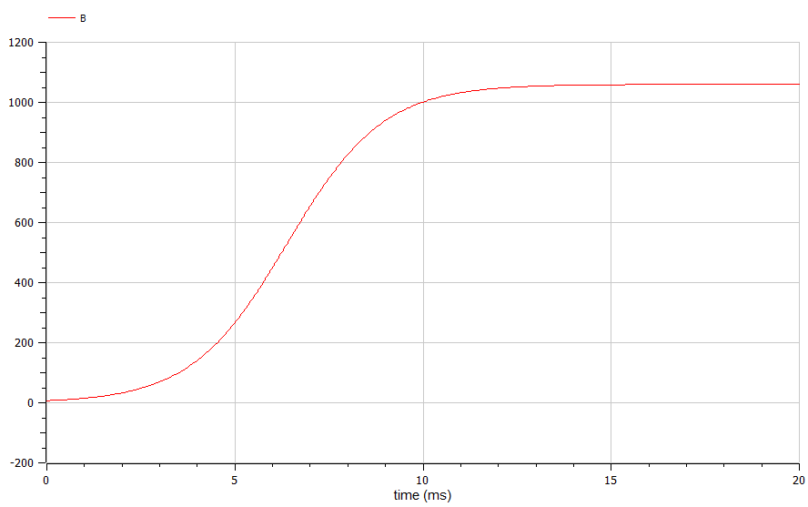
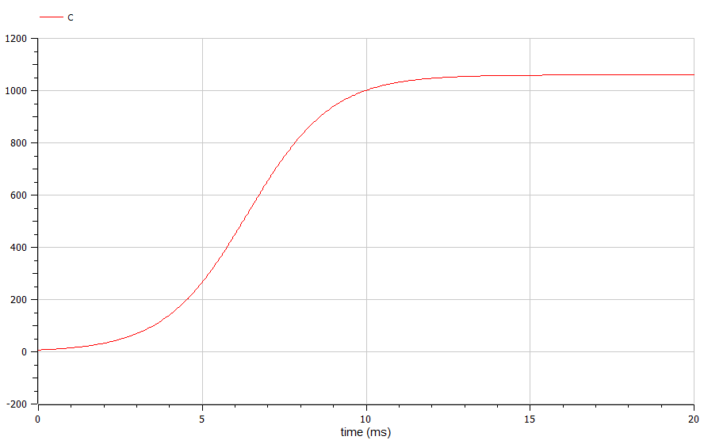

---
## Front matter
title: "Отчёт по лабораторной работе №7"
subtitle: "Эффективность рекламы"
author: "Артамонов Тимофей Евгеньевич"

## Generic otions
lang: ru-RU
toc-title: "Содержание"

## Bibliography
bibliography: bib/cite.bib
csl: pandoc/csl/gost-r-7-0-5-2008-numeric.csl

## Pdf output format
toc: true # Table of contents
toc-depth: 2
lof: true # List of figures
lot: true # List of tables
fontsize: 12pt
linestretch: 1.5
papersize: a4
documentclass: scrreprt
## I18n polyglossia
polyglossia-lang:
  name: russian
  options:
	- spelling=modern
	- babelshorthands=true
polyglossia-otherlangs:
  name: english
## I18n babel
babel-lang: russian
babel-otherlangs: english
## Fonts
mainfont: PT Serif
romanfont: PT Serif
sansfont: PT Sans
monofont: PT Mono
mainfontoptions: Ligatures=TeX
romanfontoptions: Ligatures=TeX
sansfontoptions: Ligatures=TeX,Scale=MatchLowercase
monofontoptions: Scale=MatchLowercase,Scale=0.9
## Biblatex
biblatex: true
biblio-style: "gost-numeric"
biblatexoptions:
  - parentracker=true
  - backend=biber
  - hyperref=auto
  - language=auto
  - autolang=other*
  - citestyle=gost-numeric
## Pandoc-crossref LaTeX customization
figureTitle: "Рис."
tableTitle: "Таблица"
listingTitle: "Листинг"
lofTitle: "Список иллюстраций"
lotTitle: "Список таблиц"
lolTitle: "Листинги"
## Misc options
indent: true
header-includes:
  - \usepackage{indentfirst}
  - \usepackage{float} # keep figures where there are in the text
  - \floatplacement{figure}{H} # keep figures where there are in the text
---

# Цель работы

- Рассмотреть модель рекламной кампании.
- Построить графики изменения количества клиентов для 3 случаев.
- Сравнить результаты на 2 языках программирования
  
# Теоретическое введение

Рекламная кампания — это целенаправленная система спланированных рекламных мероприятий, объединённых одной идеей и концепцией для достижения 
конкретной маркетинговой цели в рамках согласованной маркетинговой стратегии рекламодателя, в установленные предварительным анализом период времени, 
область действия, рынок и целевую аудиторию. 

Основными целями рекламных кампаний являются развитие у покупателей эффекта узнавания и припоминания товара, соответствующей степени 
информированности о продукции, положительного имиджа производителя (продавца), необходимости в приобретении продукции и увеличение 
спроса на продукцию, привлечение новых и одновременно удержание имеющихся потребителей. [@wiki:bash]

Организуется рекламная кампания нового товара или услуги. Необходимо, чтобы прибыль будущих продаж с избытком покрывала издержки на рекламу.
Вначале расходы могут превышать прибыль, поскольку лишь малая часть потенциальных покупателей будет информирована о новинке. 
Затем, при увеличении числа продаж, возрастает и прибыль, и, наконец, наступит момент, когда рынок насытиться, и рекламировать товар станет бесполезным.

Предположим, что торговыми учреждениями реализуется некоторая продукция, о которой в момент времениt из числа потенциальных покупателей $N$
знает лишь $n$ покупателей. Для ускорения сбыта продукции запускается реклама по радио, телевидению и других средств массовой информации. После запуска
рекламной кампании информация о продукции начнет распространяться среди потенциальных покупателей путем общения друг с другом. Таким образом, после
запуска рекламных объявлений скорость изменения числа знающих о продукции людей пропорциональна как числу знающих о товаре покупателей, так и числу
покупателей о нем не знающих.

Модель рекламной кампании описывается следующими величинами. Считаем, чтоd $\frac{dn}{dt}$ - скорость изменения со временем числа потребителей,
узнавших о товаре и готовых его купить, $t$ - время, прошедшее с начала рекламной кампании, $n(t)$ - число уже информированных клиентов. Эта величина
пропорциональна числу покупателей, еще не знающих о нем, это описывается следующим образом:
$\alpha_1(t) (N - n(t))$
, где $N$ - общее число потенциальных платежеспособных покупателей,
$\alpha_1(t) > 0$ - коэффициент, характеризующий интенсивность рекламной кампании (зависит от затрат на рекламу в данный момент времени).

Помимо этого, узнавшие о товаре потребители также распространяют полученную
информацию среди потенциальных покупателей, не знающих о нем (в этом случае
работает т.н. сарафанное радио). Этот вклад в рекламу описывается величиной $\alpha_2(t) n(t) (N - n(t))$
, эта величина увеличивается с увеличением потребителей узнавших о товаре. 

Математическая модель распространения рекламы описывается уравнением:

$$
\frac{dn}{dt} = 
(\alpha_1(t) + \alpha_2(t) n(t))) (N - n(t))
$$

При $\alpha_1(t) >> \alpha_2(t)$ получается модель типа модели Мальтуса, а при $\alpha_1(t) << \alpha_2(t)$ получаем уравнение логистической кривой.

Будем считать, что начало рекламной кампании происходит в момент времени t = 0.

# Постановка задачи

Даны 3 уравнения распространения рекламы:

1. $$\frac{dn}{dt} = (0.74 + 0.000074 n(t)) (N - n(t))$$
2. $$\frac{dn}{dt} = (0.000074 + 0.74 n(t)) (N - n(t))$$
3. $$\frac{dn}{dt} = (0.74 \sin(t) + 0.74 \cos(t) n) (N - n(t))$$

# Задание 

Постройте график распространения рекламы, описанные данными уравнениями. При этом объем аудитории $N = 1060$, в начальный момент о товаре знает 7 человек.

# Выполнение лабораторной работы

Написали код на Julia:
```julia

using DifferentialEquations, Plots
#Уравнение 1
promotion1(n, p, t) = (0.74 + 0.000074*n)*(p - n)
#Уравнение 2
promotion2(n, p, t) = (0.000074 + 0.74*n)*(p - n)
#Уравнение 3
promotion3(n, p, t) = (0.74*sin(t) + 0.74*cos(t)*n)*(p - n)

# Параметры и условия
p = 1060 # N - количество потенциальных клиентов
x0 = 7 # n - количество людей, знающих о продукции
tspan1 = (0, 10) # Временной промежуток для первого уравнения
tspan2 = (0, 0.02) # Временной промежуток для второго и третьего уравнений

# Решение уравнений для 3 случаев

prob1 = ODEProblem(promotion1, x0, tspan1, p)
sol1 = solve(prob1, Tsit5(), dtmax = 0.05)

prob2 = ODEProblem(promotion2, x0, tspan2, p)
sol2 = solve(prob2, Tsit5(), dtmax = 0.05)

prob3 = ODEProblem(promotion3, x0, tspan2, p)
sol3 = solve(prob3, Tsit5(), dtmax = 0.05)

# Графики решений
#plot(sol1, title = "Случай a1(t) >> a2(t)")
#plot(sol2, title = "Случай a1(t) << a2(t)")
plot(sol3, title = "Случай c непостоянными a1 и a2")
```

Записали 3 случая на языке OpenModelica 
Случай 1
```
model lab7

parameter Real a = 0.74;
parameter Real b = 0.000074;
parameter Real c = 1060;

Real A(start = 7);


equation
  der(A) = (a + b*A)*(c - A);
  
  
end lab7;

```
Случай 2
```
model lab7

parameter Real a = 0.74;
parameter Real b = 0.000074;
parameter Real c = 1060;

Real B(start = 7);


equation
  der(B) = (b + a*B)*(c - B);
  
  
end lab7;
```
Случай 3
```
model lab7

parameter Real a = 0.74;
parameter Real b = 0.000074;
parameter Real c = 1060;
Real p;
Real q;

Real C(start = 7);


equation
  der(C) = (a*p + a*q*C)*(c - C);
  p = sin(time);
  q = cos(time);
  
end lab7;
```


и получили следующие результаты.

Построили график распространения рекламы, когда $\alpha_1(t) >> \alpha_2(t)$ на Julia. (рис. [-@fig:001])

{#fig:001 width=70%}

Построили график на OpenModelica, графики одинаковые (рис. [-@fig:002])

{#fig:002 width=70%}

Построили график распространения рекламы, когда $\alpha_1(t) << \alpha_2(t)$ на Julia. (рис. [-@fig:003])

{#fig:003 width=70%}

Построили такой же график в OpenModelica. Графики совпадают. (рис. [-@fig:004])

{#fig:004 width=70%}

Построили график распространения рекламы, когда $\alpha_1(t)$ и  $\alpha_2(t)$ имеют синусоидальную и косинусоидальную зависимости от времени на Julia. (рис. [-@fig:005])

{#fig:005 width=70%}

Построили такой же график в OpenModelica. Графики совпадают. (рис. [-@fig:006])

{#fig:006 width=70%}

# Выводы

- Построили графики распространения рекламы для 3 случаев
- Сравнили результаты на Julia и OpenModelica.

# Список литературы{.unnumbered}

::: {#refs}
:::
