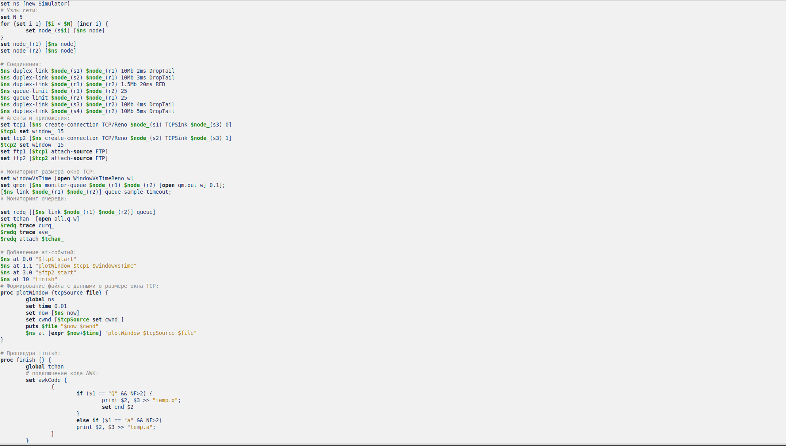
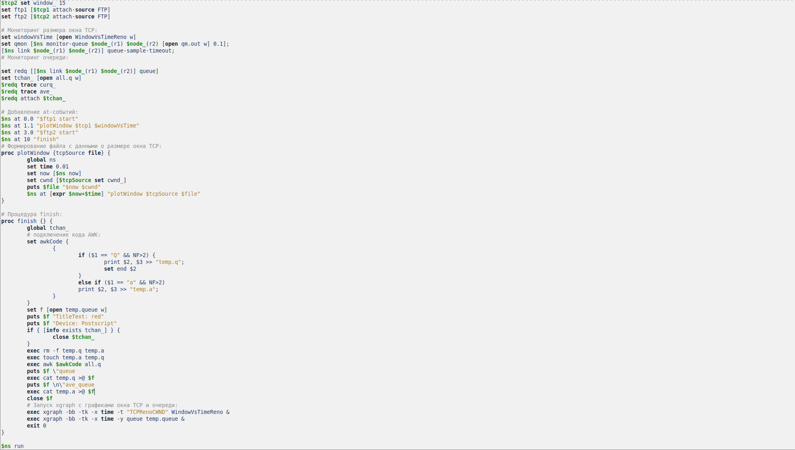
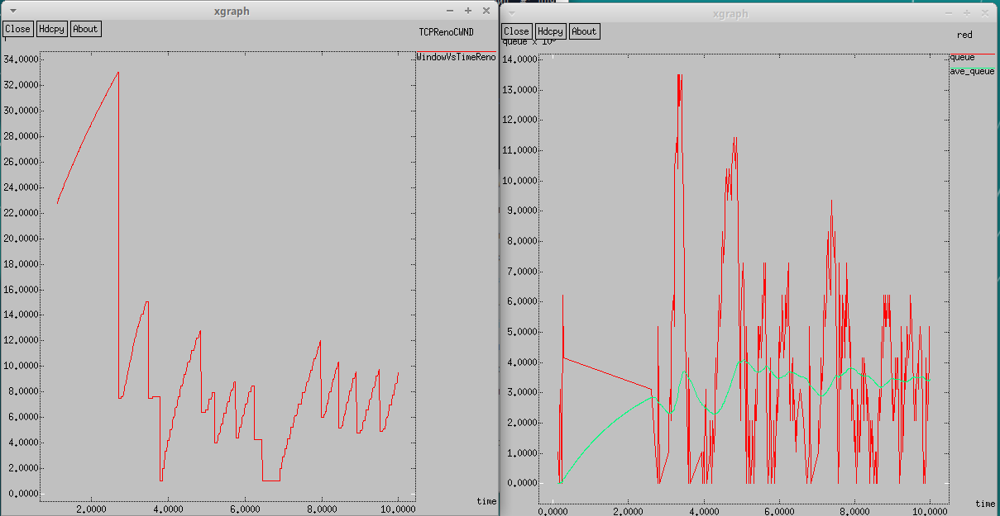
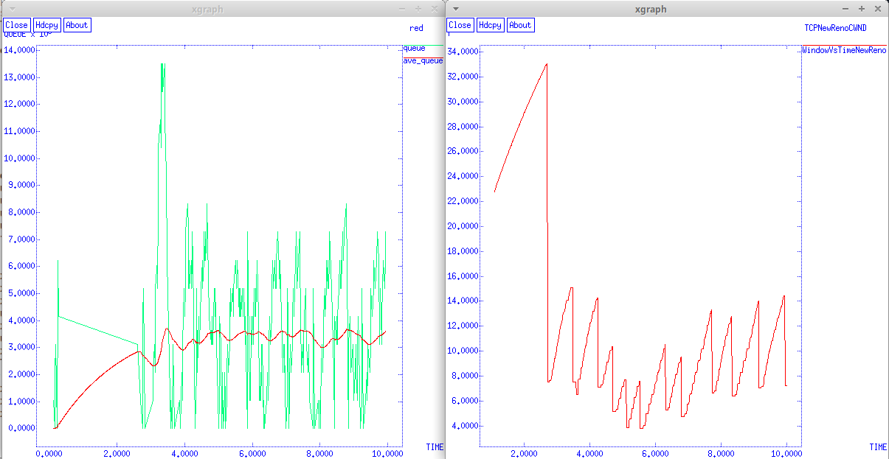
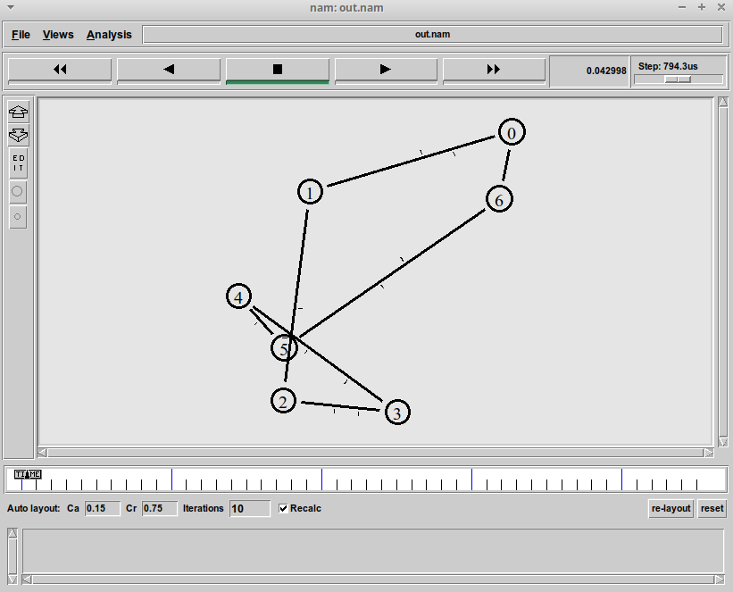
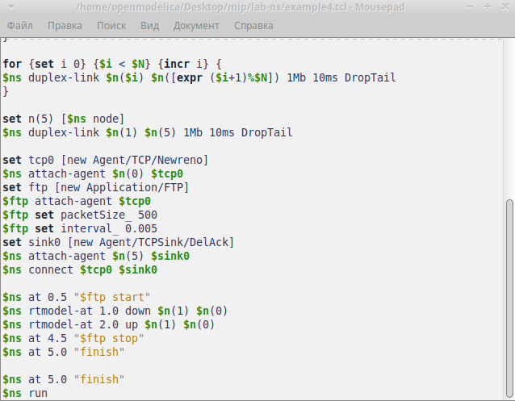
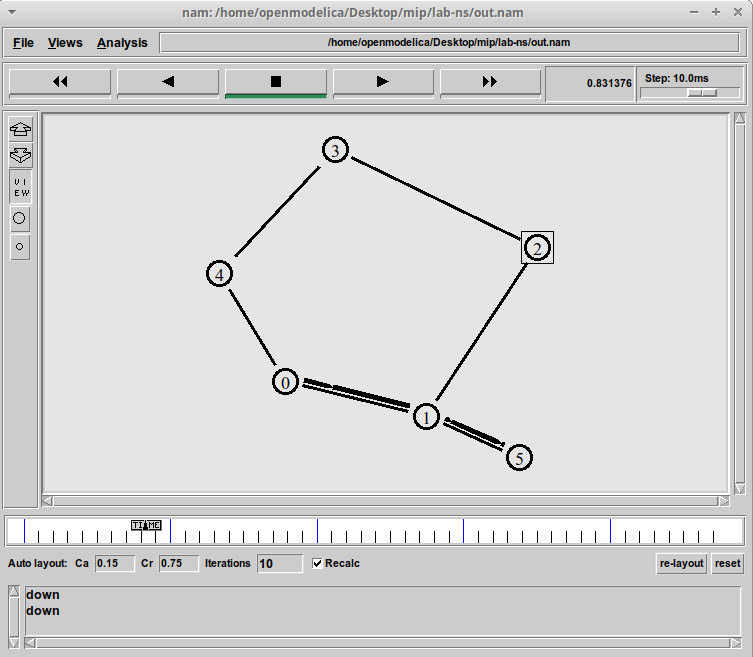
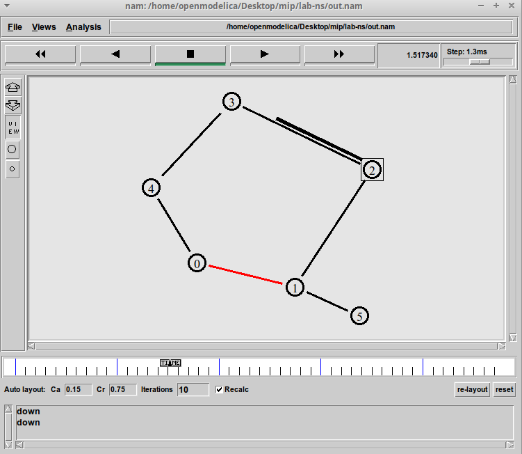

---
## Front matter
lang: ru-RU
title: Лабораторная работа № 1
subtitle: Простые модели компьютерной сети
author:
  - Артамонов Т. Е.
institute:
  - Российский университет дружбы народов, Москва, Россия
date: 8 августа 2024

## i18n babel
babel-lang: russian
babel-otherlangs: english

## Formatting pdf
toc: false
toc-title: Содержание
slide_level: 2
aspectratio: 169
section-titles: true
theme: metropolis
header-includes:
 - \metroset{progressbar=frametitle,sectionpage=progressbar,numbering=fraction}
 - '\makeatletter'
 - '\beamer@ignorenonframefalse'
 - '\makeatother'
---

# Информация

## Докладчик

:::::::::::::: {.columns align=center}
::: {.column width="70%"}

  * Артамонов Тимофей Евгеньевич
  * студент группы НКНбд-01-21
  * Российский университет дружбы народов
  * <https://github.com/teartamonov>

:::
::: {.column width="30%"}

:::
::::::::::::::

# Введение

## Цели работы

- Приобретение навыков моделирования сетей передачи данных с помощью средства имитационного моделирования NS-2
- Анализ полученных результатов моделирования

## Теоретическое введение

Network Simulator (NS-2) — один из программных симуляторов моделирования процессов в компьютерных сетях. 
NS-2 позволяет описать топологию сети, конфигурацию источников и приёмников трафика, параметры соединений 
(полосу пропускания, задержку, вероятность потерь пакетов и т.д.) и множество других параметров моделируемой системы. 
Данные о динамике трафика, состоянии соединений и объектов сети, а также информация о работе протоколов фиксируются в генерируемом trace-файле.

# Выполнение работы

## Написали первый скрипт и визуализировали модель. (рис. [-@fig:001])

{#fig:001 width=70%}

## Визуализация первого скрипта (рис. [-@fig:002])

{#fig:003 width=70%}

## Написали скрипт для немного усложнённой модели и визуализировали. (рис. [-@fig:003])

{#fig:003 width=70%}

## Визуализация. (рис. [-@fig:004])

{#fig:004 width=70%}

## Написали скрипт для сети с кольцевой топологией. (рис. [-@fig:005])

{#fig:005 width=70%}

## Визуализация. (рис. [-@fig:006])

{#fig:006 width=70%}

## Внесли изменения в предыдущий скрипт, чтобы он соответствовал требованиям упражнения. (рис. [-@fig:007])

{#fig:007 width=70%}

## Визуализация. (рис. [-@fig:008])

{#fig:008 width=70%}

## Визуализация. (рис. [-@fig:009])

{#fig:008 width=70%}

# Выводы

- Приобрели навыки моделирования сетей передачи данных с помощью средства имитационного моделирования NS-2
- Проанализировали полученных результатов моделирования
- Применили полученные знания, выполнив задание
