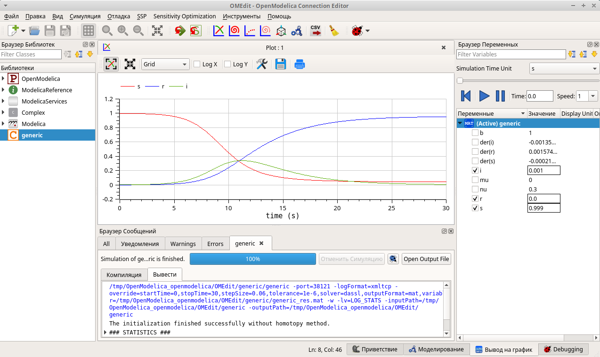

---
## Front matter
lang: ru-RU
title: Лабораторная работа № 5
subtitle: Модель эпидемии (SIR)
author:
  - Артамонов Т. Е.
institute:
  - Российский университет дружбы народов, Москва, Россия
date: 10 мая 2024

## i18n babel
babel-lang: russian
babel-otherlangs: english

## Formatting pdf
toc: false
toc-title: Содержание
slide_level: 2
aspectratio: 169
section-titles: true
theme: metropolis
header-includes:
 - \metroset{progressbar=frametitle,sectionpage=progressbar,numbering=fraction}
 - '\makeatletter'
 - '\beamer@ignorenonframefalse'
 - '\makeatother'
---

# Информация

## Докладчик

:::::::::::::: {.columns align=center}
::: {.column width="70%"}

  * Артамонов Тимофей Евгеньевич
  * студент группы НКНбд-01-21
  * Российский университет дружбы народов
  * <https://github.com/teartamonov>

:::
::: {.column width="30%"}

:::
::::::::::::::

# Введение

## Теоретическое введение

Предполагается, что особи популяции размера N могут находиться в трёх различных состояниях:
- $S$ (susceptible, уязвимые) — здоровые особи, которые находятся в группе риска и могут подхватить инфекцию;
- $I$ (infective, заражённые, распространяющие заболевание) — заразившиеся переносчики болезни;
- $R$ (recovered/removed, вылечившиеся) — те, кто выздоровел и перестал распространять болезнь (в эту категорию относят, например, приобретших иммунитет или умерших).
Внутри каждой из выделенных групп особи считаются неразличимыми по свойствам. Типичная эволюция особи популяции описывается как: $S$ -> $I$ -> $R$.
Считаем, что система замкнута, т.е. $N = S + I + R$.

## Цель работы

- реализовать модель SIR в xcos (в том числе и с использованием блока Modelica), а также в OpenModelica.
– реализовать модель SIR с учётом процесса рождения / гибели особей в xcos (в том числе и с использованием блока Modelica), а также в OpenModelica.
– построить графики эпидемического порога при различных значениях параметров модели (в частности изменяя параметр $\mu$).
– сделать анализ полученных графиков в зависимости от выбранных значений параметров модели.

# Выполнение лабораторной работы

## Построили модель SIR в xcos. (рис. [-@fig:001])

{#fig:001 width=70%}

## Запустили модель SIR. (рис. [-@fig:002])

{#fig:002 width=70%}

## Реализовали модель с помощью блока Modelica. (рис. [-@fig:003])

{#fig:003 width=70%}

## Реализовали модель SIR в OpenModelica, результат совпадает с предыдущими. (рис. [-@fig:004])

{#fig:004 width=70%}

## Реализовали модель SIR с учётом процесса рождения / гибели особей в xcos. (рис. [-@fig:005])

{#fig:005 width=70%}

## Результат моделирования. (рис. [-@fig:006])

{#fig:006 width=70%}

## Реализовали модель в xcos с использованием блока Modelica. (рис. [-@fig:007] и рис. [-@fig:008])

{#fig:007 width=70%}

{#fig:008 width=70%}

## Реализовали модель в OpenModelica. (рис. [-@fig:009])

{#fig:009 width=70%}

## Результат моделирования. (рис. [-@fig:010])

{#fig:010 width=70%}

## Параметр mu=0.001. (рис. [-@fig:011])

{#fig:011 width=70%}

## Параметр mu=0.2. (рис. [-@fig:012])

{#fig:012 width=70%}

## Параметр mu=0.5. (рис. [-@fig:013])

{#fig:013 width=70%}

## Выводы

- Чем меньше параметр $\mu$ тем более похожа модель на стандартную модель SIR, чем ближе параметр к единице, тем сильнее кривые выпрямляются.
- реализовали модель SIR в xcos (в том числе и с использованием блока Modelica), а также в OpenModelica.
– реализовали модель SIR с учётом процесса рождения / гибели особей в xcos (в том числе и с использованием блока Modelica), а также в OpenModelica.
– построили графики эпидемического порога при различных значениях параметров модели (в частности изменяя параметр $\mu$).
– сделали анализ полученных графиков в зависимости от выбранных значений параметров модели.
