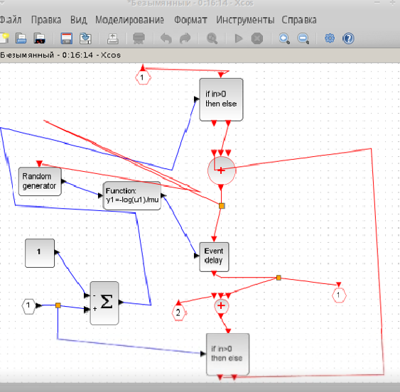
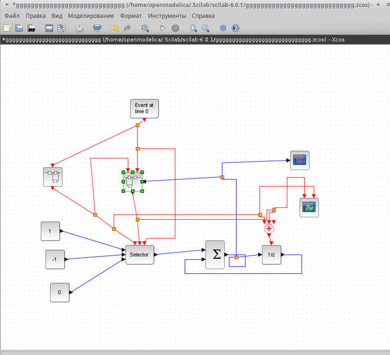

---
## Front matter
lang: ru-RU
title: Лабораторная работа № 7
subtitle: Модель M | M | 1 | inf
author:
  - Артамонов Т. Е.
institute:
  - Российский университет дружбы народов, Москва, Россия
date: 10 мая 2024

## i18n babel
babel-lang: russian
babel-otherlangs: english

## Formatting pdf
toc: false
toc-title: Содержание
slide_level: 2
aspectratio: 169
section-titles: true
theme: metropolis
header-includes:
 - \metroset{progressbar=frametitle,sectionpage=progressbar,numbering=fraction}
 - '\makeatletter'
 - '\beamer@ignorenonframefalse'
 - '\makeatother'
---

# Информация

## Докладчик

:::::::::::::: {.columns align=center}
::: {.column width="70%"}

  * Артамонов Тимофей Евгеньевич
  * студент группы НКНбд-01-21
  * Российский университет дружбы народов
  * <https://github.com/teartamonov>

:::
::: {.column width="30%"}

:::
::::::::::::::

# Введение

## Цель работы

- Реализация модели в xcos
  
# Выполнение лабораторной работы

Начальные данные: $\lambda = 0.3$, $\mu = 0.35$, $z_0 = 6$

## Реализовали первый суперблок. (рис. [-@fig:001])

{#fig:001 width=70%}

## Реализовали второй суперблок. (рис. [-@fig:002])

{#fig:002 width=70%}

## Создали общую схему моедли M|M|1|inf. (рис. [-@fig:003])

{#fig:003 width=70%}

## Запустили модель. (рис. [-@fig:004])

{#fig:004 width=70%}

## Выводы

- Реализовали модели в xcos
  
