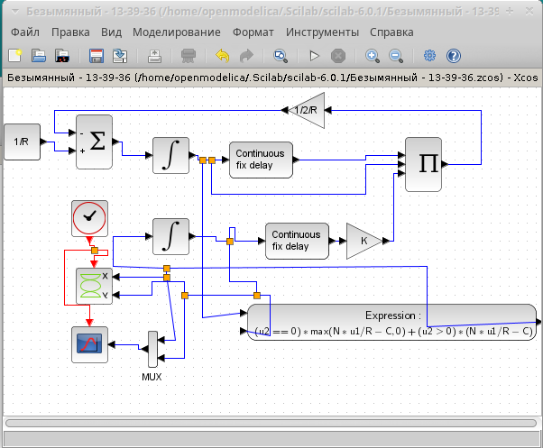
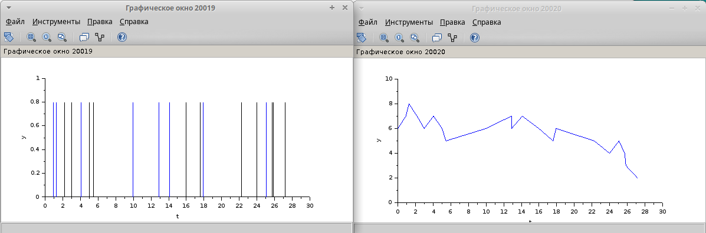
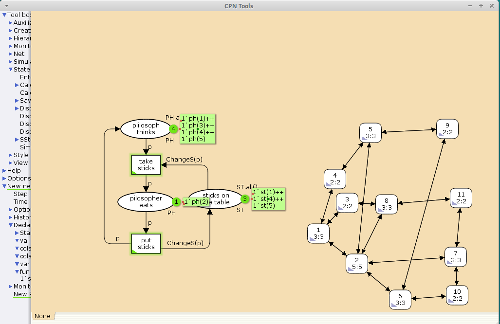
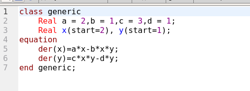
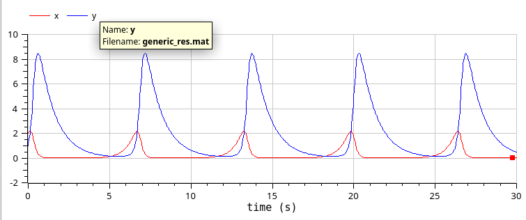
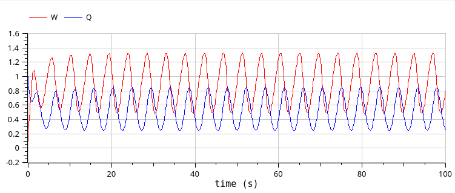
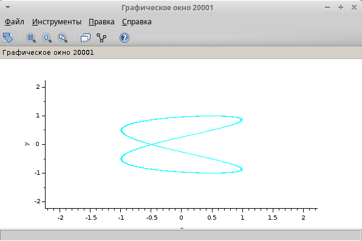
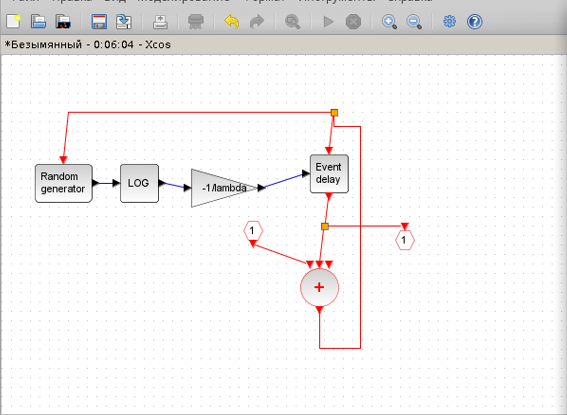

---
## Front matter
lang: ru-RU
title: Упражнение
subtitle: Задание для самостоятельного выполнения
author:
  - Артамонов Т. Е.
institute:
  - Российский университет дружбы народов, Москва, Россия
date: 4 мая 2024

## i18n babel
babel-lang: russian
babel-otherlangs: english

## Formatting pdf
toc: false
toc-title: Содержание
slide_level: 2
aspectratio: 169
section-titles: true
theme: metropolis
header-includes:
 - \metroset{progressbar=frametitle,sectionpage=progressbar,numbering=fraction}
 - '\makeatletter'
 - '\beamer@ignorenonframefalse'
 - '\makeatother'
---

# Информация

## Докладчик

:::::::::::::: {.columns align=center}
::: {.column width="70%"}

  * Артамонов Тимофей Евгеньевич
  * студент группы НКНбд-01-21
  * Российский университет дружбы народов
  * <https://github.com/teartamonov>

:::
::: {.column width="30%"}

:::
::::::::::::::

# Введение

## Теоретическое введение

Фигуры Лиссажу — траектории, прочерчиваемые точкой, совершающей одновременно два гармонических колебания в двух взаимно перпендикулярных направлениях. Впервые изучены французским учёным Жюлем Антуаном Лиссажу.

## Задание

Построить с помощью xcos фигуры Лиссажу с различными значениями параметров.

# Выполнение лабораторной работы

## Построили модель в xcos и запустили с начальными параметрами. (рис. [-@fig:001])

{#fig:001 width=70%}

## Дальше поэкспериментировали с параметрами. (рис. [-@fig:002])

{#fig:002 width=70%}

## Другие параметры. (рис. [-@fig:003])

{#fig:003 width=70%}

## Другие параметры. (рис. [-@fig:004])

{#fig:004 width=70%}

## Другие параметры.  (рис. [-@fig:005])

{#fig:005 width=70%}

## Другие параметры. (рис. [-@fig:006])

{#fig:006 width=70%}

## Другие параметры. (рис. [-@fig:007])

{#fig:007 width=70%}

## Другие параметры. (рис. [-@fig:008])

{#fig:008 width=70%}

## Другие параметры. (рис. [-@fig:009])

{#fig:009 width=70%}

## Другие параметры. (рис. [-@fig:010])

{#fig:010 width=70%}

## Другие параметры. (рис. [-@fig:011])

{#fig:011 width=70%}

## Выводы

- Поистроили фигуры Лиссажу, поэкспериментировав с параметрами
