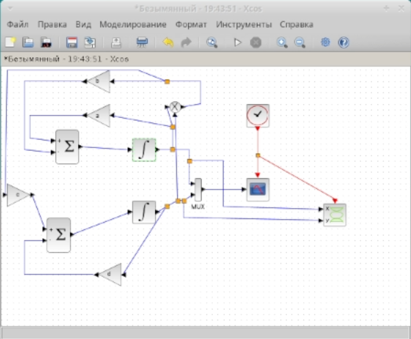

---
## Front matter
lang: ru-RU
title: Лабораторная работа № 6
subtitle: Модель "хищник–жертва"
author:
  - Артамонов Т. Е.
institute:
  - Российский университет дружбы народов, Москва, Россия
date: 10 мая 2024

## i18n babel
babel-lang: russian
babel-otherlangs: english

## Formatting pdf
toc: false
toc-title: Содержание
slide_level: 2
aspectratio: 169
section-titles: true
theme: metropolis
header-includes:
 - \metroset{progressbar=frametitle,sectionpage=progressbar,numbering=fraction}
 - '\makeatletter'
 - '\beamer@ignorenonframefalse'
 - '\makeatother'
---

# Информация

## Докладчик

:::::::::::::: {.columns align=center}
::: {.column width="70%"}

  * Артамонов Тимофей Евгеньевич
  * студент группы НКНбд-01-21
  * Российский университет дружбы народов
  * <https://github.com/teartamonov>

:::
::: {.column width="30%"}

:::
::::::::::::::

# Введение

## Теоретическое введение

Модель «хищник–жертва» (модель Лотки — Вольтерры) представляет собой модель межвидовой конкуренции. 
$x = ax - bxy$, 
$y = cxy - dy$
где x - количество жертв; y - количество хищников; a, b, c, d - коэффициенты, отражающие взаимодействия между видами: a - коэффициент рождаемости жертв; b - коэффициент убыли жертв; c - коэффициент рождения хищников; d - коэффициент убыли хищников.

## Цель работы

- Реализация модели в xcos
- Реализация модели с помощью блока Modelica в xcos
- Реализация модели в OpenModelica
  
# Выполнение лабораторной работы

## Построили модель хищник-жертва в xcos. (рис. [-@fig:001])

{#fig:001 width=70%}

## Запустили модель. (рис. [-@fig:002])

{#fig:002 width=70%}

## Запустили модель. (рис. [-@fig:003])

{#fig:003 width=70%}

## Реализовали модель хищник-жертва с помощью блока Modelica. (рис. [-@fig:004])

{#fig:004 width=70%}

## Результат моделирования совпадает с результатом предыдущей схемы. (рис. [-@fig:005])

{#fig:005 width=70%}

## Реализуем модель в OpenModelica. (рис. [-@fig:006])

{#fig:006 width=70%}

## Результат моделирования совпадает с моделью в xcos. (рис. [-@fig:007] и рис. [-@fig:008])

{#fig:007 width=70%}

## Результат моделирования совпадает с моделью в xcos. (рис. [-@fig:007] и рис. [-@fig:008])

{#fig:008 width=70%}

## Выводы

- Реализовали модели в xcos
- Реализовали модели с помощью блока Modelica в xcos
- Реализовали модели в OpenModelica
