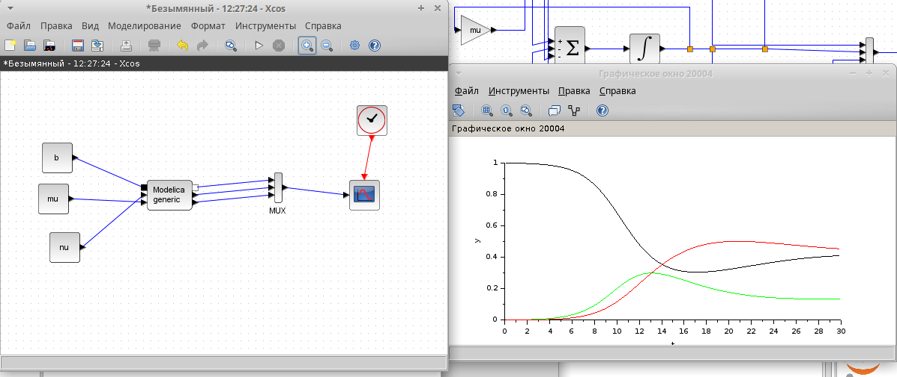
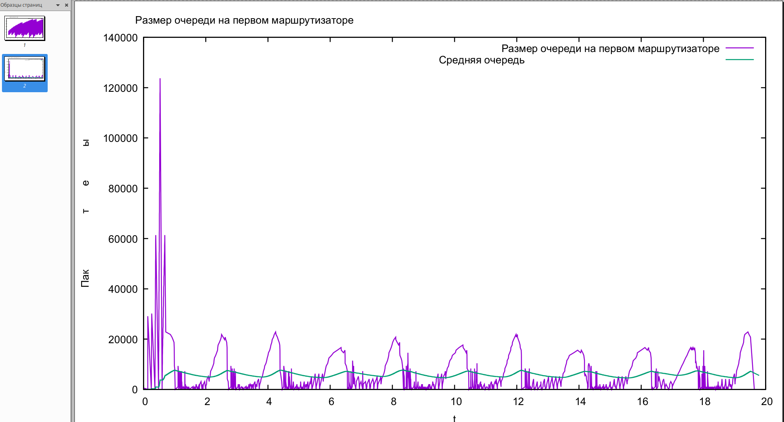
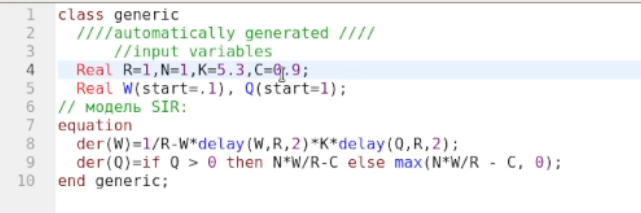
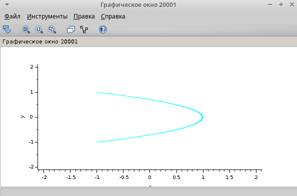

---
## Front matter
title: "Лабораторная работа № 14"
subtitle: "Модели обработки заказов"
author: "Артамонов Тимофей Евгеньевич"

## Generic otions
lang: ru-RU
toc-title: "Содержание"

## Bibliography
bibliography: bib/cite.bib
csl: pandoc/csl/gost-r-7-0-5-2008-numeric.csl

## Pdf output format
toc: true # Table of contents
toc-depth: 2
lof: true # List of figures
lot: true # List of tables
fontsize: 12pt
linestretch: 1.5
papersize: a4
documentclass: scrreprt
## I18n polyglossia
polyglossia-lang:
  name: russian
  options:
	- spelling=modern
	- babelshorthands=true
polyglossia-otherlangs:
  name: english
## I18n babel
babel-lang: russian
babel-otherlangs: english
## Fonts
mainfont: PT Serif
romanfont: PT Serif
sansfont: PT Sans
monofont: PT Mono
mainfontoptions: Ligatures=TeX
romanfontoptions: Ligatures=TeX
sansfontoptions: Ligatures=TeX,Scale=MatchLowercase
monofontoptions: Scale=MatchLowercase,Scale=0.9
## Biblatex
biblatex: true
biblio-style: "gost-numeric"
biblatexoptions:
  - parentracker=true
  - backend=biber
  - hyperref=auto
  - language=auto
  - autolang=other*
  - citestyle=gost-numeric
## Pandoc-crossref LaTeX customization
figureTitle: "Рис."
tableTitle: "Таблица"
listingTitle: "Листинг"
lofTitle: "Список иллюстраций"
lotTitle: "Список таблиц"
lolTitle: "Листинги"
## Misc options
indent: true
header-includes:
  - \usepackage{indentfirst}
  - \usepackage{float} # keep figures where there are in the text
  - \floatplacement{figure}{H} # keep figures where there are in the text
---

# Введение

## Цель работы

- Построить различные модели обработки заказов
- Проанализировать отчеты по этим моделям
- Построить гистрограмму модели
  
## Теоретическое введение

Пакет GPSS (General Purpose Simulation System - система моделирования общего назначения) предназначен для имитационного моделирования дискретных систем.
Имитационная модель в GPSS представляет собой последовательность текстовых строк, каждая из которых определяет правила создания, перемещения, задержки и удаления транзактов.
Транзакт - динамический объект, отождествляемый с заявкой на обслуживание, который перемещается между элементами системы.

# Выполнение лабораторной работы

Построим первую модель (рис. [-@fig:001] )

В интернет-магазине заказы принимает один оператор. Интервалы поступления заказов распределены равномерно с интервалом 15 +- 4 мин. Время оформления заказа также распределено равномерно на интервале 10 +- 2 мин. Обработка поступивших заказов происходит в порядке очереди (FIFO). Требуется разработать модель обработки заказов в течение 8 часов.

{#fig:001 width=70%}

Запустим модель (рис. [-@fig:002] )

{#fig:002 width=70%}

Скорректируем модель в соответствии с изменениями входных данных (рис. [-@fig:003] )

{#fig:003 width=70%}

Запустим модель. (рис. [-@fig:004] )

Время в очереди стало больше, время обслуживания меньше, использование оператора стало больше, всего заявок поступило и было обработано больше.

{#fig:004 width=70%}

Построим гистограмму распределения заявок в очереди. (рис. [-@fig:005] )

{#fig:005 width=70%}

Запустим модель. (рис. [-@fig:006] )

{#fig:006 width=70%}

Построим отчёт (рис. [-@fig:007] )

{#fig:007 width=70%}

Вторая часть отчета (рис. [-@fig:008])

{#fig:008 width=70%}

Построим модель обслуживания двух типов заказов от клиентов в интернет-магазине. (рис. [-@fig:009] )

Заявки первого типа поступают каждые 15 +- 4 мин. Заявки второго типа - каждые 30 +- 8 мин. Время оформление первого типа 10 +- 2 мин, время оформление второго типа - 5 +- 2 мин.

{#fig:009 width=70%}

Запустим модель. (рис. [-@fig:010] )

{#fig:010 width=70%}

Скорректируем модель, чтобы число заказов с дополнительным пакетом услуг составляло 30% от общего числа заказов. (рис. [-@fig:011] )

{#fig:011 width=70%}

Запустим модель. (рис. [-@fig:012] )

{#fig:012 width=70%}

Построим модель оформления заказов несколькими операторами. (рис. [-@fig:013] )

Заказы принимают 4 оператора. Интервалы поступления заказов 5 +- 2 мин. Время оформления заказа 10 +- 2 мин. Требуется определить характеристики очереди заявок на оформление 

{#fig:013 width=70%}

Запустим модель. (рис. [-@fig:014] )

{#fig:014 width=70%}

Добавим условие, что если в очереди больше 2 человек, клиент отказывается от обслуживаня. (рис. [-@fig:015] )

{#fig:015 width=70%}

Запустим модель. (рис. [-@fig:016] )

{#fig:016 width=70%}

Сделаем время оформления больше. (рис. [-@fig:017])

{#fig:017 width=70%}

Запустим модель. (рис. [-@fig:018])

{#fig:018 width=70%}

# Выводы

- Построили различные модели обработки заказов
- Проанализировали отчеты по этим моделям
- Научились строить гистрограмму модели
