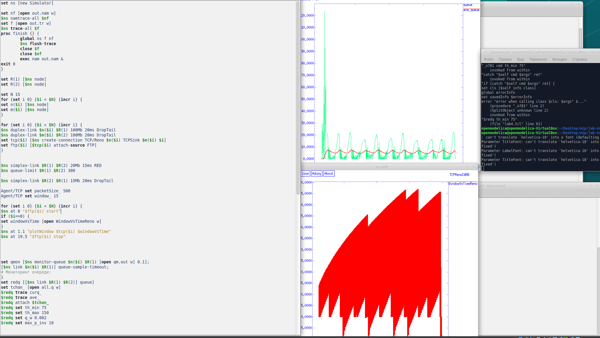
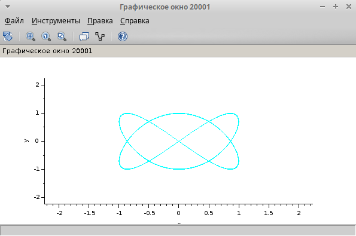
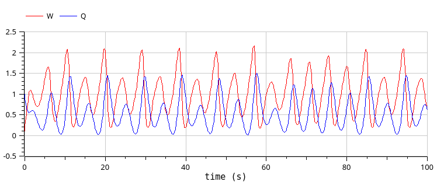

---
## Front matter
title: "Лабораторная работа № 13"
subtitle: "Задание для самостоятельного выполнения"
author: "Артамонов Тимофей Евгеньевич"

## Generic otions
lang: ru-RU
toc-title: "Содержание"

## Bibliography
bibliography: bib/cite.bib
csl: pandoc/csl/gost-r-7-0-5-2008-numeric.csl

## Pdf output format
toc: true # Table of contents
toc-depth: 2
lof: true # List of figures
lot: true # List of tables
fontsize: 12pt
linestretch: 1.5
papersize: a4
documentclass: scrreprt
## I18n polyglossia
polyglossia-lang:
  name: russian
  options:
	- spelling=modern
	- babelshorthands=true
polyglossia-otherlangs:
  name: english
## I18n babel
babel-lang: russian
babel-otherlangs: english
## Fonts
mainfont: PT Serif
romanfont: PT Serif
sansfont: PT Sans
monofont: PT Mono
mainfontoptions: Ligatures=TeX
romanfontoptions: Ligatures=TeX
sansfontoptions: Ligatures=TeX,Scale=MatchLowercase
monofontoptions: Scale=MatchLowercase,Scale=0.9
## Biblatex
biblatex: true
biblio-style: "gost-numeric"
biblatexoptions:
  - parentracker=true
  - backend=biber
  - hyperref=auto
  - language=auto
  - autolang=other*
  - citestyle=gost-numeric
## Pandoc-crossref LaTeX customization
figureTitle: "Рис."
tableTitle: "Таблица"
listingTitle: "Листинг"
lofTitle: "Список иллюстраций"
lotTitle: "Список таблиц"
lolTitle: "Листинги"
## Misc options
indent: true
header-includes:
  - \usepackage{indentfirst}
  - \usepackage{float} # keep figures where there are in the text
  - \floatplacement{figure}{H} # keep figures where there are in the text
---

# Введение

## Цель работы

- Провести анализ модели
- Реализовать модель в cpntools
- Вычислить пространство состояний
- Сформировать отчёт о пространстве состояний и проанализировать его
- Построить граф пространства состояний

## Теоретическое введение

Заявка (команды программы, операнды) поступает в оперативную память, затем передается на прибор для обработки. 
После этого заявка может равновероятно обратиться к оперативной памяти или к одному из двух внешних запоминающих устройств (B1 и B2). 
Прежде чем записать информацию на внешний накопитель, необходимо вторично обратиться к центральному процессору, определяющему состояние накопителя и выдающему необходимую управляющую информацию. Накопители (B1 и B2) могут работать в 3-х режимах:
1) B1 - занят, B2 - свободен;
2) B2 - свободен, B1 - занят;
3) B1 - занят, B2 - занят.

# Выполнение лабораторной работы

Проведем анализ сети. (рис. [-@fig:001])

Сеть безопасна и ограничена, т.к. в каждой позиции не более одной фишки, не сохраняющая, т.к. при переходе T5 в состояние P6 количество фишек уменьшается на 1.

{#fig:001 width=60%}

Построили модель в cpntools. (рис. [-@fig:002])

{#fig:002 width=70%}

Результат работы модели. (рис. [-@fig:003])

{#fig:003 width=70%}

Сформировали отчёт о пространстве состояний. (рис. [-@fig:004])

{#fig:004 width=70%}

Построили граф пространства состояний. (рис. [-@fig:005])

{#fig:005 width=70%}

# Выводы

- Провели анализ модели
- Реализовали модель в cpntools
- Вычислили пространство состояний
- Сформировали отчёт о пространстве состояний и проанализировали его
- Построили граф пространства состояний
