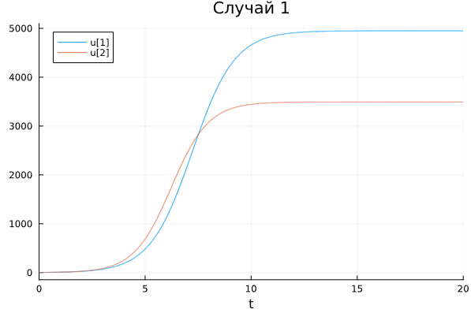

---
## Front matter
lang: ru-RU
title: Лабораторная работа № 8
subtitle: Модель конкуренции двух фирм
author:
  - Артамонов Т. Е.
institute:
  - Российский университет дружбы народов, Москва, Россия
date: 8 августа 2024

## i18n babel
babel-lang: russian
babel-otherlangs: english

## Formatting pdf
toc: false
toc-title: Содержание
slide_level: 2
aspectratio: 169
section-titles: true
theme: metropolis
header-includes:
 - \metroset{progressbar=frametitle,sectionpage=progressbar,numbering=fraction}
 - '\makeatletter'
 - '\beamer@ignorenonframefalse'
 - '\makeatother'
---

# Информация

## Докладчик

:::::::::::::: {.columns align=center}
::: {.column width="70%"}

  * Артамонов Тимофей Евгеньевич
  * студент группы НКНбд-01-21
  * Российский университет дружбы народов
  * <https://github.com/teartamonov>

:::
::: {.column width="30%"}

:::
::::::::::::::

# Введение

## Цель работы

- Рассмотреть модель конкуренции 2 фирм.
- Построить графики изменения оборотных средств двух фирм для 2 случаев:
  - только c экономическим фактором влияния
  - с добавлением социально-психологических факторов
- Сравнить результаты на 2 языках программирования

## Теоретическое введение

Конкуренция - это борьба между экономическими субъектами за максимально эффективное использование факторов производства, при единых правилах для всех её участников. 

Для построения модели конкуренции хотя бы двух фирм необходимо рассмотреть модель одной фирмы. Вначале рассмотрим модель фирмы, производящей продукт долговременного пользования, когда цена его определяется балансом спроса и предложения. 
Примем, что этот продукт занимает определенную нишу рынка и конкуренты в ней отсутствуют.
Обозначим:
$q$ - максимальная потребность одного человека в продукте в единицу времени.
$p_{cr}$ - критическая стоимость продукта.
$N$ - число потребителей производимого продукта.
$M_1, M_2$ - оборотные средства предприятия.
$\tau_1, \tau_2$ - длительность производственного цикла.
$p_1, p_2$ - себестоимость продукта, то есть переменные издержки на производство единицы продукции.

В уменьшение доли оборотных средств, вкладываемых в производство, эквивалентно удлинению производственного цикла. Поэтому мы в дальнейшем положим: δ = 1, а параметр τ будем считать временем цикла, с учётом сказанного.

## Постановка задачи

**Конкуренция двух фирм**
**Случай 1**

Рассмотрим две фирмы, производящие взаимозаменяемые товары одинакового качества и находящиеся в одной рыночной нише. 
Последнее означает, что у потребителей в этой нише нет априорных предпочтений, и они приобретут тот или иной товар, не обращая внимания на знак фирмы.
В этом случае, на рынке устанавливается единая цена, которая определяется балансом суммарного предложения и спроса. Иными словами, в рамках нашей модели конкурентная борьба ведётся только рыночными методами. 
То есть, конкуренты могут влиять на противника путем изменения параметров своего производства: себестоимость, время цикла, но не могут прямо вмешиваться в ситуацию на рынке («назначать» цену или влиять на потребителей каким-либо иным способом.)
Учтем, что товарный баланс устанавливается быстро, то есть, произведенный каждой фирмой товар не накапливается, а реализуется по цене p.

## Постановка задачи

Тогда

$$
\frac{dM_1}{dt} = M_1 - \frac{b}{c_1} M_1 M_2 - \frac{a_1}{c_1} M_1^2
$$

$$
\frac{dM_2}{dt} = \frac{c_2}{c_1} M_2 - \frac{b}{c_1} M_1 M_2 - \frac{a_2}{c_1} M_2^2
$$

где

$a_1 = \frac{p_{cr}}{\tau_1 p_1^2 N q}$, $a_2 = \frac{p_{cr}}{\tau_2 p_2^2 N q}$, $b = a_1 = \frac{p_{cr}}{\tau_1 p_1^2 \tau_2 p_2^2 N q}$, $c1 = \frac{p_{cr} - p_1}{\tau_1 p_1}$, $c2 = \frac{p_{cr} - p_2}{\tau_2 p_2}$

## Постановка задачи

**Случай 2.** 

Рассмотрим модель, когда, помимо экономического фактора влияния (изменение себестоимости, производственного цикла, использование кредита и т.п.), используются еще и социально-психологические факторы –
формирование общественного предпочтения одного товара другому, не зависимо от их качества и цены. 
В этом случае взаимодействие двух фирм будет зависеть друг от друга, соответственно коэффициент перед $M_1 M_2$ будет отличаться. 
Пусть в рамках рассматриваемой модели динамика изменения объемов продаж фирмы 1 и фирмы 2 описывается следующей системой уравнений:

$$
\frac{dM1}{dt} = M_1 - \frac{b}{c_1} M_1 M_2 - \frac{a_1}{c_1} M_1^2
$$

$$
\frac{dM2}{dt} = \frac{c_2}{c_1} M_2 - (\frac{b}{c_1} + 0.00043) M_1 M_2 - \frac{a_2}{c_1} M_2^2
$$

Будем считать, что начало рекламной кампании происходит в момент времени t = 0.

## Задание 

1. Постройте графики изменения оборотных средств фирмы 1 и фирмы 2 без учета постоянных издержек и с веденной нормировкой для случая 1.
2. Постройте графики изменения оборотных средств фирмы 1 и фирмы 2 без учета постоянных издержек и с веденной нормировкой для случая 2.
   
# Выполнение работы

## Построили график изменения оборотных средств двух фирм для случая 1 на Julia. (рис. [-@fig:001])

{#fig:001 width=70%}

## Построили график на OpenModelica, графики одинаковые (рис. [-@fig:002])

{#fig:003 width=70%}

## Построили график изменения оборотных средств двух фирм для случая 2 на Julia. (рис. [-@fig:003])

{#fig:003 width=70%}

## Построили такой же график в OpenModelica. Графики совпадают. (рис. [-@fig:004])

{#fig:003 width=70%}

# Выводы

- Построили графики изменения оборотных средств двух фирм для двух случаев
- Сравнили результаты на Julia и OpenModelica.
