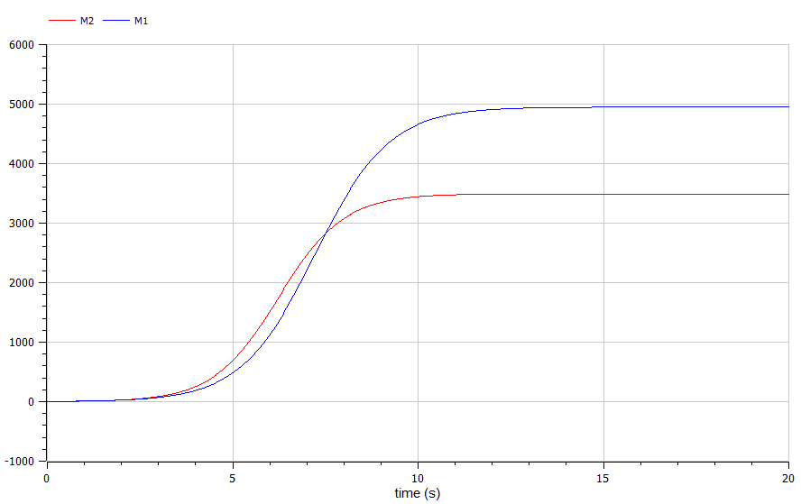
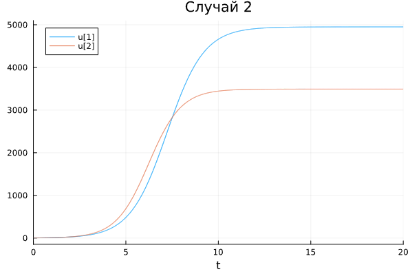
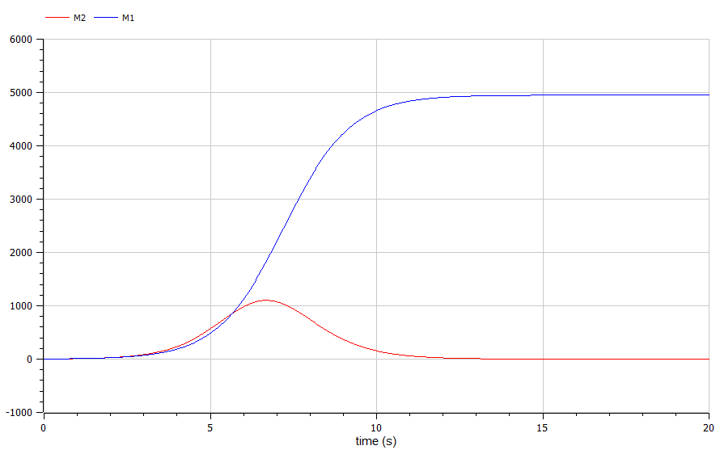

---
## Front matter
title: "Отчёт по лабораторной работе №8"
subtitle: "Модель конкуренции двух фирм"
author: "Артамонов Тимофей Евгеньевич"

## Generic otions
lang: ru-RU
toc-title: "Содержание"

## Bibliography
bibliography: bib/cite.bib
csl: pandoc/csl/gost-r-7-0-5-2008-numeric.csl

## Pdf output format
toc: true # Table of contents
toc-depth: 2
lof: true # List of figures
lot: true # List of tables
fontsize: 12pt
linestretch: 1.5
papersize: a4
documentclass: scrreprt
## I18n polyglossia
polyglossia-lang:
  name: russian
  options:
	- spelling=modern
	- babelshorthands=true
polyglossia-otherlangs:
  name: english
## I18n babel
babel-lang: russian
babel-otherlangs: english
## Fonts
mainfont: PT Serif
romanfont: PT Serif
sansfont: PT Sans
monofont: PT Mono
mainfontoptions: Ligatures=TeX
romanfontoptions: Ligatures=TeX
sansfontoptions: Ligatures=TeX,Scale=MatchLowercase
monofontoptions: Scale=MatchLowercase,Scale=0.9
## Biblatex
biblatex: true
biblio-style: "gost-numeric"
biblatexoptions:
  - parentracker=true
  - backend=biber
  - hyperref=auto
  - language=auto
  - autolang=other*
  - citestyle=gost-numeric
## Pandoc-crossref LaTeX customization
figureTitle: "Рис."
tableTitle: "Таблица"
listingTitle: "Листинг"
lofTitle: "Список иллюстраций"
lotTitle: "Список таблиц"
lolTitle: "Листинги"
## Misc options
indent: true
header-includes:
  - \usepackage{indentfirst}
  - \usepackage{float} # keep figures where there are in the text
  - \floatplacement{figure}{H} # keep figures where there are in the text
---

# Цель работы

- Рассмотреть модель конкуренции 2 фирм.
- Построить графики изменения оборотных средств двух фирм для 2 случаев:
  - только c экономическим фактором влияния
  - с добавлением социально-психологических факторов
- Сравнить результаты на 2 языках программирования
  
# Теоретическое введение

Конкуренция - это борьба между экономическими субъектами за максимально эффективное использование факторов производства, при единых правилах для всех её участников.  [@wiki:bash]

Для построения модели конкуренции хотя бы двух фирм необходимо рассмотреть модель одной фирмы. Вначале рассмотрим модель фирмы, производящей продукт долговременного пользования, когда цена его определяется балансом спроса и предложения. 
Примем, что этот продукт занимает определенную нишу рынка и конкуренты в ней отсутствуют.
Обозначим:
$q$ - максимальная потребность одного человека в продукте в единицу времени.
$p_{cr}$ - критическая стоимость продукта.
$N$ - число потребителей производимого продукта.
$M_1, M_2$ - оборотные средства предприятия.
$\tau_1, \tau_2$ - длительность производственного цикла.
$p_1, p_2$ - себестоимость продукта, то есть переменные издержки на производство единицы продукции.

В уменьшение доли оборотных средств, вкладываемых в производство, эквивалентно удлинению производственного цикла. Поэтому мы в дальнейшем положим: δ = 1, а параметр τ будем считать временем цикла, с учётом сказанного.

# Постановка задачи

**Конкуренция двух фирм**
**Случай 1**

Рассмотрим две фирмы, производящие взаимозаменяемые товары одинакового качества и находящиеся в одной рыночной нише. 
Последнее означает, что у потребителей в этой нише нет априорных предпочтений, и они приобретут тот или иной товар, не обращая внимания на знак фирмы.
В этом случае, на рынке устанавливается единая цена, которая определяется балансом суммарного предложения и спроса. Иными словами, в рамках нашей модели конкурентная борьба ведётся только рыночными методами. 
То есть, конкуренты могут влиять на противника путем изменения параметров своего производства: себестоимость, время цикла, но не могут прямо вмешиваться в ситуацию на рынке («назначать» цену или влиять на потребителей каким-либо иным способом.)
Учтем, что товарный баланс устанавливается быстро, то есть, произведенный каждой фирмой товар не накапливается, а реализуется по цене p.
Тогда

$$
\frac{dM_1}{dt} = M_1 - \frac{b}{c_1} M_1 M_2 - \frac{a_1}{c_1} M_1^2
$$

$$
\frac{dM_2}{dt} = \frac{c_2}{c_1} M_2 - \frac{b}{c_1} M_1 M_2 - \frac{a_2}{c_1} M_2^2
$$

где

$a_1 = \frac{p_{cr}}{\tau_1 p_1^2 N q}$, $a_2 = \frac{p_{cr}}{\tau_2 p_2^2 N q}$, $b = a_1 = \frac{p_{cr}}{\tau_1 p_1^2 \tau_2 p_2^2 N q}$, $c1 = \frac{p_{cr} - p_1}{\tau_1 p_1}$, $c2 = \frac{p_{cr} - p_2}{\tau_2 p_2}$


**Случай 2.** 

Рассмотрим модель, когда, помимо экономического фактора влияния (изменение себестоимости, производственного цикла, использование кредита и т.п.), используются еще и социально-психологические факторы –
формирование общественного предпочтения одного товара другому, не зависимо от их качества и цены. 
В этом случае взаимодействие двух фирм будет зависеть друг от друга, соответственно коэффициент перед $M_1 M_2$ будет отличаться. 
Пусть в рамках рассматриваемой модели динамика изменения объемов продаж фирмы 1 и фирмы 2 описывается следующей системой уравнений:

$$
\frac{dM1}{dt} = M_1 - \frac{b}{c_1} M_1 M_2 - \frac{a_1}{c_1} M_1^2
$$

$$
\frac{dM2}{dt} = \frac{c_2}{c_1} M_2 - (\frac{b}{c_1} + 0.00043) M_1 M_2 - \frac{a_2}{c_1} M_2^2
$$

Будем считать, что начало рекламной кампании происходит в момент времени t = 0.

# Задание 

1. Постройте графики изменения оборотных средств фирмы 1 и фирмы 2 без учета постоянных издержек и с веденной нормировкой для случая 1.
2. Постройте графики изменения оборотных средств фирмы 1 и фирмы 2 без учета постоянных издержек и с веденной нормировкой для случая 2.

# Выполнение лабораторной работы

Написали код на Julia:
```julia

using DifferentialEquations, Plots
#Начальные условия
M_01 = 3.6
M_02 = 2.9
p_cr = 32
N = 33
q = 1
t1 = 25
t2 = 15
p1 = 8
p2 = 10.5

#Функция для случая 1 только c экономическим фактором влияния
function competition1(du, u, p, t)
    a1, a2, b, c1, c2 = p
    du[1] = u[1] - b/c1*u[1]*u[2] - a1/c1*u[1]^2
    du[2] = c2/c1*u[2] - b/c1*u[1]*u[2] - a2/c1*u[2]^2
end  

#Функция для случая 2 с добавлением социально-психологических факторов
function competition2(du, u, p, t)
    a1, a2, b, c1, c2 = p
    du[1] = u[1] - b/c1*u[1]*u[2] - a1/c1*u[1]^2
    du[2] = c2/c1*u[2] - (b/c1 + 0.00043)*u[1]*u[2] - a2/c1*u[2]^2
end  

#Параметры
pp1 = p_cr/(t1*t1 * p1*p1 * N * q)
pp2 = p_cr/(t2*t2 * p2*p2 * N * q)
pp3 = p_cr/(t1*t1 * p1*p1 * t2*t2 * p2*p2 * N * q)
pp4 = (p_cr - p1)/(t1*p1)
pp5 = (p_cr - p2)/(t2*p2)

p = [pp1, pp2, pp3, pp4, pp5]
tspan = (0, 20)

#Задание проблемы и решение для случая 1
prob1 = ODEProblem(competition1, [M_01, M_02], tspan, p)
sol1 = solve(prob1, Tsit5(), dtmax = 0.05)

#Задание проблемы и решение для случая 2
prob2 = ODEProblem(competition2, [M_01, M_02], tspan, p)
sol2 = solve(prob1, Tsit5(), dtmax = 0.05)

#Графики
#plot(sol1, title = "Случай 1")
plot(sol2, title = "Случай 2")
```

Записали 3 случая на языке OpenModelica 
Случай 1
```
model lab8

parameter Real p_cr = 32;
parameter Real N = 33;
parameter Real q = 1;
parameter Real t1 = 25;
parameter Real t2 = 15;
parameter Real p1 = 8;
parameter Real p2 = 10.5;

Real M1(start = 3.6);
Real M2(start = 2.9);

parameter Real a1 = p_cr/(t1*t1 * p1*p1 * N * q);
parameter Real a2 = p_cr/(t2*t2 * p2*p2 * N * q);
parameter Real b = p_cr/(t1*t1 * p1*p1 * t2*t2 * p2*p2 * N * q);
parameter Real c1 = (p_cr - p1)/(t1*p1);
parameter Real c2 = (p_cr - p2)/(t2*p2);

equation
    der(M1) = M1 - b/c1*M1*M2 - a1/c1*M1^2;
    der(M2) = c2/c1*M2 - b/c1*M1*M2 - a2/c1*M2^2;
    
  
end lab8;
```
Случай 2
```
model lab8

parameter Real p_cr = 32;
parameter Real N = 33;
parameter Real q = 1;
parameter Real t1 = 25;
parameter Real t2 = 15;
parameter Real p1 = 8;
parameter Real p2 = 10.5;

Real M1(start = 3.6);
Real M2(start = 2.9);

parameter Real a1 = p_cr/(t1*t1 * p1*p1 * N * q);
parameter Real a2 = p_cr/(t2*t2 * p2*p2 * N * q);
parameter Real b = p_cr/(t1*t1 * p1*p1 * t2*t2 * p2*p2 * N * q);
parameter Real c1 = (p_cr - p1)/(t1*p1);
parameter Real c2 = (p_cr - p2)/(t2*p2);

equation
    der(M1) = M1 - b/c1*M1*M2 - a1/c1*M1^2;
    der(M2) = c2/c1*M2 - (b/c1 + 0.00043)*M1*M2 - a2/c1*M2^2;
    
  
end lab8;
```

и получили следующие результаты.

Построили график изменения оборотных средств двух фирм для случая 1 на Julia. (рис. [-@fig:001])

{#fig:001 width=70%}

Построили график на OpenModelica, графики одинаковые (рис. [-@fig:002])

{#fig:003 width=70%}

Построили график изменения оборотных средств двух фирм для случая 2 на Julia. (рис. [-@fig:003])

{#fig:003 width=70%}

Построили такой же график в OpenModelica. Графики совпадают. (рис. [-@fig:004])

{#fig:003 width=70%}

# Выводы

- Построили графики изменения оборотных средств двух фирм для двух случаев
- Сравнили результаты на Julia и OpenModelica.

# Список литературы{.unnumbered}

::: {#refs}
:::
