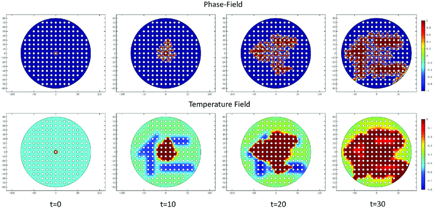

---
## Front matter
lang: ru-RU
title: "Групповой проект. Тема: Рост дендритов"
subtitle: "Этап 2"
author:
	- Артамонов Т. Е.,
	- Федорина Э. В.,
	- Морозов М. E.,
	- Коротун И. И.,
	- Маслова А. С.
institute: Российский Университет Дружбы Народов, Moscow, Russian Federation

date: 7 марта 2024

## i18n babel
babel-lang: russian
babel-otherlangs: english

## Formatting pdf
toc: false
toc-title: Содержание
slide_level: 2
aspectratio: 169
section-titles: true
theme: metropolis
header-includes:
 - \metroset{progressbar=frametitle,sectionpage=progressbar,numbering=fraction}
 - '\makeatletter'
 - '\beamer@ignorenonframefalse'
 - '\makeatother'
---

# Информация

## Состав исследовательской команды

Студенты группы НКНбд-01-21

- Артамонов Тимофей Евгеньевич
- Федорина Эрнест Васильевич
- Морозов Михаил Евгеньвич
- Коротун Илья Игоревич
- Маслова Анастасия Сергеевна

# Вводная часть

## Вторый этап проекта. Алгоритм решения задачи. 

Алгоритм— это упорядоченный набор действий, который необходимо выполнить для решения поставленной задачи.

# Алгоритм 

# Этап 1: Инициализация параметров симуляции

На первом этапе задается начальное состояние системы, включающее все необходимые физические параметры материала и начальные условия для симуляции. Этот этап критически важен для обеспечения корректности всего процесса моделирования.

## Определение параметров вещества:

- **Плотность $\rho$** 
- **Удельная теплота плавления $L$**
- **Теплоемкость при постоянном давлении $c_p$**
- **Коэффициент теплопроводности $\kappa$**
- **Температура плавления $T_m$** 

{#fig:001 width=50%}

## Задание начальных условий:

- **Начальная температура расплава $T_\infty$**
- **Безразмерное переохлаждение $S$**: Вычисляется как $S = \frac{c_p (T_m - T_\infty)}{L}$, является ключевым фактором, определяющим начало процесса кристаллизации.

# Этап 2: Настройка симуляционной сетки

## Этап 2: Настройка симуляционной сетки

Создается симуляционная сетка, служащая пространством для моделирования роста дендритов. Этап включает подготовку сетки и начальную конфигурацию затравки кристаллизации.

## Создание симуляционной сетки:

- **Определение размера сетки $N \times N$**, где $N$ — количество узлов по каждому измерению. Размер сетки должен обеспечивать достаточную детализацию для визуализации роста дендритов и учитывать вычислительные ограничения.
- **Установка расстояния между узлами сетки $h$**, влияющего на детализацию моделирования и точность результатов.

## Инициализация затравки:

- В центре сетки создается затравка, представляющая участок в твердой фазе. Размер и форма затравки могут варьироваться в зависимости от целей симуляции.

{#fig:002 width=70%}

# Этап 3: Расчет температурного поля

## Этап 3: Расчет температурного поля

Моделирование распределения температуры в системе с течением времени, являющееся основой для анализа роста дендритов.

## Применение уравнения теплопроводности:

- Используется уравнение теплопроводности $\rho c_p \frac{\partial T}{\partial t} = \kappa \nabla^2 T$ для моделирования изменений температуры, учитывая приток тепла в систему и его распределение.

## Численное решение уравнения:

- Реализация численного метода, например, метода конечных разностей, для аппроксимации производных и расчета температуры в каждом узле сетки. Выбор временного шага $\Delta t$ и пространственного шага $h$ важен для стабильности и точности расчетов.

# Этап 4: Моделирование роста дендритов

## Этап 4: Моделирование роста дендритов

На этом этапе реализуется моделирование роста дендритов на основе рассчитанных температурных полей и соответствующих физических законов.

## Использование условия Стефана:

- Скорость роста границы кристаллизации $V$ определяется условием Стефана: $V = \frac{\kappa}{\rho L} (\nabla T|_s - \nabla T|_l)$, что позволяет связать скорость роста с разницей градиентов температуры на границе фаз.
- Исходя из скорости $V$, происходит обновление положения границы кристаллизации, тем самым моделируя расширение твердой фазы.

## Применение условия Гиббса-Томсона:

- Условие Гиббса-Томсона корректирует температуру плавления на границе кристалла: $T_b = T_m \left(1 - \frac{\gamma T_m}{\rho L^2 R}\right)$, учитывая кривизну границы и влияние поверхностного натяжения.

## Обновление температурного поля:

- После каждого этапа роста дендритов требуется пересчитать температурное поле, учитывая выделение или поглощение теплоты за счет фазового перехода.

{#fig:003 width=70%}

## Обновление температурного поля

{#fig:004 width=70%}

# Этап 5: Анализ структуры дендритов

## Этап 5: Анализ структуры дендритов

Проводится детальный анализ сформированных дендритных структур для оценки их свойств и сравнения с теоретическими и экспериментальными данными.

## Оценка морфологии:

- Анализ формы, размеров и ветвления дендритов позволяет понять механизмы их роста и определить влияющие на это процессы.
- Использование методов измерения фрактальной размерности дает количественную оценку сложности структуры дендритов.

## Сравнение с экспериментальными данными:

- Сопоставление результатов моделирования с экспериментальными данными по росту дендритов помогает проверить точность и надежность модели.

# Этап 6: Визуализация и оценка результатов

## Этап 6: Визуализация и оценка результатов

Заключительный этап проекта включает подготовку визуализации процесса роста дендритов и анализ полученных результатов.

## Визуализация роста дендритов:

- Использование графических инструментов для создания изображений и видео, демонстрирующих динамику роста дендритов и конечную структуру.
- Визуализация является ключевым элементом для наглядного представления исследования и помогает в анализе результатов.

## Анализ результатов и формулировка выводов:

- Оценка эффективности использованных методов моделирования, сопоставление с теоретическими предположениями и экспериментальными данными.
- Подготовка выводов о механизмах роста дендритов и возможных путях улучшения процессов материаловедения на основе результатов моделирования.

{#fig:005 width=50%}

# Вывод

## Вывод

Представлен процесс разработки алгоритма моделирования роста дендритов, начиная с инициализации параметров симуляции и настройки симуляционной сетки, и заканчивая моделированием роста дендритов и анализом их структуры. Алгоритмы играют важную роль в решении задач, обеспечивая более эффективный и точный способ получения результатов, а каждый этап моделирования от инициализации параметров до анализа результатов имеет свою важную роль в создании полной картины процесса.
