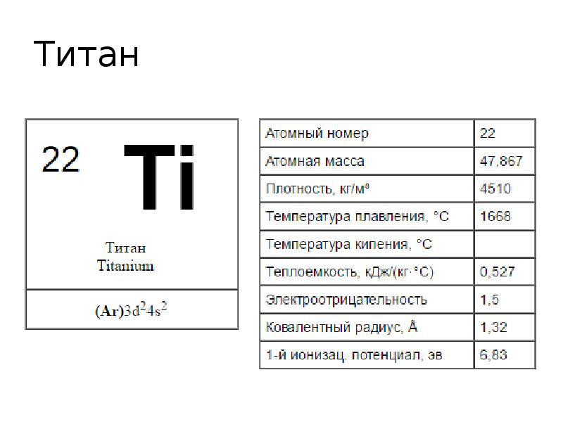
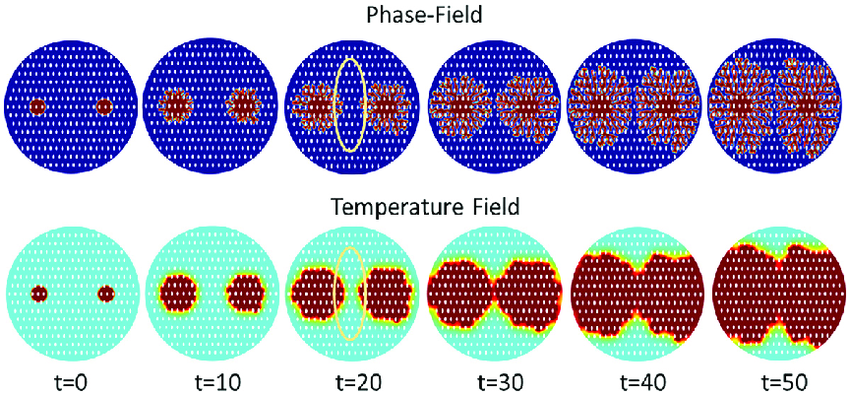

---
## Front matter
title: "Групповой проект. Тема: Рост дендритов"
subtitle: "Этап 2"
author: 
	- Артамонов Тимофей Евгеньевич 
	- Федорина Эрнест Васильевич
	- Морозов Михаил Евгеньвич
	- Коротун Илья Игоревич
	- Маслова Анастасия Сергеевна
	
institute: RUDN University, Moscow, Russian Federation

## Generic options
lang: ru-RU
toc-title: "Содержание"

## Bibliography
bibliography: bib/cite.bib
csl: pandoc/csl/gost-r-7-0-5-2008-numeric.csl

## Pdf output format
toc: true # Table of contents
toc-depth: 2
lof: true # List of figures
lot: false # List of tables
fontsize: 12pt
linestretch: 1.5
papersize: a4
documentclass: scrreprt
## I18n polyglossia
polyglossia-lang:
  name: russian
  options:
	- spelling=modern
	- babelshorthands=true
polyglossia-otherlangs:
  name: english
## I18n babel
babel-lang: russian
babel-otherlangs: english
## Fonts
mainfont: PT Serif
romanfont: PT Serif
sansfont: PT Sans
monofont: PT Mono
mainfontoptions: Ligatures=TeX
romanfontoptions: Ligatures=TeX
sansfontoptions: Ligatures=TeX,Scale=MatchLowercase
monofontoptions: Scale=MatchLowercase,Scale=0.9
## Biblatex
biblatex: true
biblio-style: "gost-numeric"
biblatexoptions:
  - parentracker=true
  - backend=biber
  - hyperref=auto
  - language=auto
  - autolang=other*
  - citestyle=gost-numeric
## Pandoc-crossref LaTeX customization
figureTitle: "Рис."
tableTitle: "Таблица"
listingTitle: "Листинг"
lofTitle: "Список иллюстраций"
lotTitle: "Список таблиц"
lolTitle: "Листинги"
## Misc options
indent: true
header-includes:
  - \usepackage{indentfirst}
  - \usepackage{float} # keep figures where there are in the text
  - \floatplacement{figure}{H} # keep figures where there are in the text
---

# Введение

На втором этапе группового проекта нужно сделать алгоритм решения задачи. Прежде чем описывать этапы алгоритма скажем о том для чего он нужен. Алгоритм — это упорядоченный набор действий, который необходимо выполнить для решения поставленной задачи. Алгоритмы нужны для: Получения результата более эффективным и быстрым путем и уменьшения количества ошибок, которые возникают при решении задач вручную.

# Шаг 1: Инициализация параметров симуляции

На первом этапе задается начальное состояние системы, включающее все необходимые физические параметры материала и начальные условия для симуляции. Этот этап критически важен для обеспечения корректности всего процесса моделирования.

## Определение параметров вещества:

- **Плотность $\rho$**: Масса на единицу объема материала, необходима для расчета массы вещества в заданном объеме и определения выделяемого или поглощаемого тепла в процессе фазового перехода.
- **Удельная теплота плавления $L$**: Количество теплоты, необходимое для перехода единицы массы вещества из твердого состояния в жидкое без изменения температуры, используется для расчета тепловых эффектов при кристаллизации.
- **Теплоемкость при постоянном давлении $c_p$**: Энергия, требуемая для нагрева единицы массы вещества на один градус Цельсия, важна для определения изменений температуры в материале.
- **Коэффициент теплопроводности $\kappa$**: Описывает способность материала проводить тепло, критичен для расчета распределения температуры в системе.
- **Температура плавления $T_m$** [@wiki:temp:bash] : Температура перехода вещества из твердого состояния в жидкое, определяет начальную точку фазового перехода.

{#fig:001 width=70%}

## Задание начальных условий:

- **Начальная температура расплава $T_\infty$**: Температура жидкой фазы в начале симуляции, влияет на степень переохлаждения и условия начала кристаллизации.
- **Безразмерное переохлаждение $S$**: Вычисляется как $S = \frac{c_p (T_m - T_\infty)}{L}$, является ключевым фактором, определяющим начало процесса кристаллизации.

# Шаг 2: Настройка симуляционной сетки

Создается симуляционная сетка [@wiki:mesh:bash], служащая пространством для моделирования роста дендритов. Этап включает подготовку сетки и начальную конфигурацию затравки кристаллизации.

## Создание симуляционной сетки:

- **Определение размера сетки $N \times N$**, где $N$ — количество узлов по каждому измерению. Размер сетки должен обеспечивать достаточную детализацию для визуализации роста дендритов и учитывать вычислительные ограничения.
- **Установка расстояния между узлами сетки $h$**, влияющего на детализацию моделирования и точность результатов.

## Инициализация затравки:

- В центре сетки создается затравка [@wiki:seed:bash], представляющая участок в твердой фазе. Размер и форма затравки могут варьироваться в зависимости от целей симуляции.

{#fig:002 width=70%}

# Шаг 3: Расчет температурного поля

Моделирование распределения температуры в системе с течением времени, являющееся основой для анализа роста дендритов.

## Применение уравнения теплопроводности:

- Используется уравнение теплопроводности $\rho c_p \frac{\partial T}{\partial t} = \kappa \nabla^2 T$ для моделирования изменений температуры, учитывая приток тепла в систему и его распределение.

## Численное решение уравнения:

- Реализация численного метода, например, метода конечных разностей, для аппроксимации производных и расчета температуры в каждом узле сетки. Выбор временного шага $\Delta t$ и пространственного шага $h$ важен для стабильности и точности расчетов.

# Шаг 4: Моделирование роста дендритов

На этом этапе реализуется моделирование роста дендритов на основе рассчитанных температурных полей и соответствующих физических законов [@medvedev:bash].

## Использование условия Стефана:

- Скорость роста границы кристаллизации $V$ определяется условием Стефана: $V = \frac{\kappa}{\rho L} (\nabla T|_s - \nabla T|_l)$, что позволяет связать скорость роста с разницей градиентов температуры на границе фаз.
- Исходя из скорости $V$, происходит обновление положения границы кристаллизации, тем самым моделируя расширение твердой фазы.

## Применение условия Гиббса-Томсона:

- Условие Гиббса-Томсона корректирует температуру плавления на границе кристалла: $T_b = T_m \left(1 - \frac{\gamma T_m}{\rho L^2 R}\right)$, учитывая кривизну границы и влияние поверхностного натяжения.

## Обновление температурного поля:

- После каждого этапа роста дендритов требуется пересчитать температурное поле, учитывая выделение или поглощение теплоты за счет фазового перехода.

{#fig:003 width=70%}

{#fig:004 width=70%}

# Шаг 5: Анализ структуры дендритов

Проводится детальный анализ сформированных дендритных структур для оценки их свойств и сравнения с теоретическими и экспериментальными данными.

## Оценка морфологии:

- Анализ формы, размеров и ветвления дендритов позволяет понять механизмы их роста и определить влияющие на это процессы.
- Использование методов измерения фрактальной размерности дает количественную оценку сложности структуры дендритов.

## Сравнение с экспериментальными данными:

- Сопоставление результатов моделирования с экспериментальными данными по росту дендритов помогает проверить точность и надежность модели.

# Шаг 6: Визуализация и оценка результатов

Заключительный этап проекта включает подготовку визуализации процесса роста дендритов и анализ полученных результатов.

## Визуализация роста дендритов:

- Использование графических инструментов для создания изображений и видео, демонстрирующих динамику роста дендритов и конечную структуру.
- Визуализация является ключевым элементом для наглядного представления исследования и помогает в анализе результатов.

## Анализ результатов и формулировка выводов:

- Оценка эффективности использованных методов моделирования, сопоставление с теоретическими предположениями и экспериментальными данными.
- Подготовка выводов о механизмах роста дендритов и возможных путях улучшения процессов материаловедения на основе результатов моделирования.

{#fig:005 width=70%}

# Вывод

Представлен процесс разработки алгоритма моделирования роста дендритов, начиная с инициализации параметров симуляции и настройки симуляционной сетки, и заканчивая моделированием роста дендритов и анализом их структуры. Алгоритмы играют важную роль в решении задач, обеспечивая более эффективный и точный способ получения результатов, а каждый этап моделирования от инициализации параметров до анализа результатов имеет свою важную роль в создании полной картины процесса.

# Список литературы{.unnumbered}

::: {#refs}
:::
