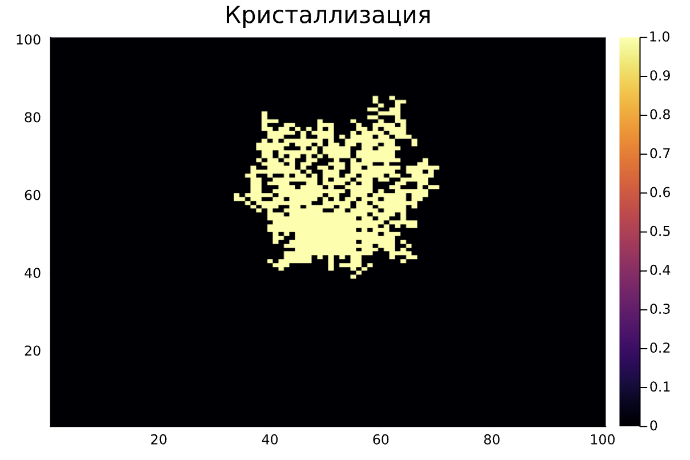
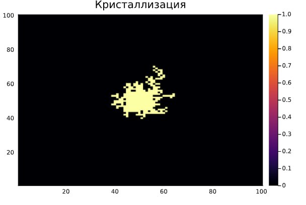

---
## Front matter
lang: ru-RU
title: "Групповой проект. Тема: Рост дендритов"
subtitle: "Этап 4"
author:
	- Артамонов Т. Е.,
	- Федорина Э. В.,
	- Морозов М. E.,
	- Коротун И. И.,
	- Маслова А. С.
institute: Российский Университет Дружбы Народов, Moscow, Russian Federation

date: 7 марта 2024

## i18n babel
babel-lang: russian
babel-otherlangs: english

## Formatting pdf
toc: false
toc-title: Содержание
slide_level: 2
aspectratio: 169
section-titles: true
theme: metropolis
header-includes:
 - \metroset{progressbar=frametitle,sectionpage=progressbar,numbering=fraction}
 - '\makeatletter'
 - '\beamer@ignorenonframefalse'
 - '\makeatother'
---

# Информация

## Состав исследовательской команды

Студенты группы НКНбд-01-21

- Артамонов Тимофей Евгеньевич
- Федорина Эрнест Васильевич
- Морозов Михаил Евгеньвич
- Коротун Илья Игоревич
- Маслова Анастасия Сергеевна

# Вводная часть

Ещё на первом этапе мы сформировали и описали научную проблему для нашего проекта. Давайте кратко повторим, в чем она заключалась.

Дендритный рост, происходящий в результате кристаллизации, существенно влияет на характеристики материалов. Особенностью является его чувствительность к множеству факторов, включая переохлаждение расплава, скорость охлаждения, наличие примесей и поверхностное натяжение. Таким образом, научная проблема заключается в разработке теоретических и численных моделей, способных предсказывать динамику роста дендритов и их влияние на микроструктуру сформированных материалов.

# Основная часть проекта

## Теоретическая часть в реализации

Для построенния модели роста дендритов важно использовать следущее:

1) Условие Стефана

2) Уравнение теплопроводности

3) Правильно составить условие кристаллизации

4) Учесть, что температура изменяется быстрее, чем затвердевает материал

## Алгоритм

Если кратко рассмотреть наш алгоритм, то он состоит из 6 пунктов, а именно:

1. Инициализация параметров симуляции

2. Настройка симуляционной сетки

3. Расчет температурного поля

4. Моделирование роста дендритов

5. Анализ структуры дендритов

6. Визуализация и оценка результатов

## Результаты

В результате мы получили такие изображения. В качестве примера мы взяли расплавленный Цезий и посмотрели как он кристаллизуется. Стоит понимать, что из за наличия естественной случайности, у нас получаются различные изображения.

## Результаты

:::::::::::::: {.columns align=center}
::: {.column width="60%"}

{ #fig:001 width=70%}

:::
::: {.column width="60%"}

{ #fig:002 width=70%}

:::
::::::::::::::

# Вывод

Нам удалось построить модель, которая приблизительно описывает рост дендритов, используя Julia. 
Наша модель роста дендритов, позволяет имитировать процесс затвердевания материала и формирования кристаллических структур схожих с тем, что может происходит в природе. Стоит понимать, что мы построили достаточно упрощенную модель, которая не учитывает многих факторов, которые оказывают влияние на рост кристалла, из-за сложности реализации в программной среде. Таким образом в будущем данную модель можно улучшить, чтобы она более точно описывала поведение структур в естественных условиях.
