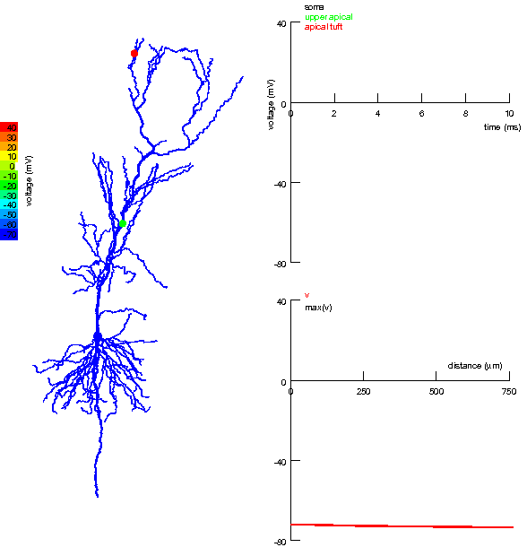

---
## Front matter
title: "Групповой проект. Тема: Рост дендритов"
subtitle:
author: 
	- Артамонов Т. Е.,
	- Федорина Э. В.,
	- Морозов М. E.,
	- Коротун И. И.,
	- Маслова А. С.
	
institute: RUDN University, Moscow, Russian Federation

## Generic otions
lang: ru-RU
toc-title: "Содержание"

## Bibliography
bibliography: bib/cite.bib
csl: pandoc/csl/gost-r-7-0-5-2008-numeric.csl

## Pdf output format
toc: true # Table of contents
toc-depth: 2
lof: true # List of figures
lot: false # List of tables
fontsize: 12pt
linestretch: 1.5
papersize: a4
documentclass: scrreprt
## I18n polyglossia
polyglossia-lang:
  name: russian
  options:
	- spelling=modern
	- babelshorthands=true
polyglossia-otherlangs:
  name: english
## I18n babel
babel-lang: russian
babel-otherlangs: english
## Fonts
mainfont: PT Serif
romanfont: PT Serif
sansfont: PT Sans
monofont: PT Mono
mainfontoptions: Ligatures=TeX
romanfontoptions: Ligatures=TeX
sansfontoptions: Ligatures=TeX,Scale=MatchLowercase
monofontoptions: Scale=MatchLowercase,Scale=0.9
## Biblatex
biblatex: true
biblio-style: "gost-numeric"
biblatexoptions:
  - parentracker=true
  - backend=biber
  - hyperref=auto
  - language=auto
  - autolang=other*
  - citestyle=gost-numeric
## Pandoc-crossref LaTeX customization
figureTitle: "Рис."
tableTitle: "Таблица"
listingTitle: "Листинг"
lofTitle: "Список иллюстраций"
lotTitle: "Список таблиц"
lolTitle: "Листинги"
## Misc options
indent: true
header-includes:
  - \usepackage{indentfirst}
  - \usepackage{float} # keep figures where there are in the text
  - \floatplacement{figure}{H} # keep figures where there are in the text
---

# Введение

Дендриты [@wiki:bash] — это древовидные кристаллические структуры, которые образуются в процессе кристаллизации из переохлажденного расплава. Они играют ключевую роль в определении микроструктуры и, следовательно, физических свойств материалов. Процесс роста дендритов зависит от множества факторов. Если исследовать механизм формирования дендритов, то можно научиться изменять свойства различных сплавов, а значит исследование полезно не только для теории, но и для практики.

# Формирование и описание научной проблемы

## Проблема управления и предсказания морфологии дендритной кристаллизации в переохлажденных расплавах

В процессе формирования кристаллических структур из переохлажденных расплавов ключевым является понимание и управление механизмами роста дендритов, поскольку именно они определяют конечные физические свойства материалов. Дендритный рост, происходящий в результате кристаллизации, существенно влияет на микроструктуру и, как следствие, на механические, электрические и тепловые характеристики материалов. Особенностью дендритного роста является его чувствительность к множеству факторов, включая переохлаждение расплава, скорость охлаждения, наличие примесей и поверхностное натяжение. Таким образом, научная проблема заключается в разработке теоретических и численных моделей, способных точно предсказывать динамику роста дендритов и их влияние на микроструктуру сформированных материалов.

Решение этой проблемы откроет новые возможности для оптимизации процессов производства материалов с высокими эксплуатационными характеристиками и для создания новых материалов с уникальными свойствами.

# Важные формулы

- **Безразмерное переохлаждение:**
$$S = \frac{c_p (T_m - T_\infty)}{L}$$

- **Уравнение теплопроводности:**
$$\rho c_p \frac{\partial T}{\partial t} = \kappa \nabla^2 T$$

- **Условие Стефана для скорости \(V\):**
$$V = \frac{\kappa}{\rho L} (\nabla T|_s - \nabla T|_l)$$

- **Условие Гиббса-Томсона:**
$$T_b = T_m \left(1 - \frac{\gamma T_m}{\rho L^2 R}\right)$$

- **Кинетическая модификация температуры на границе:**
$$\Delta T_b = -T_m \beta V$$

# Описание алгоритма построения модели

## Шаг 1: Инициализация параметров симуляции

На первом этапе задается начальное состояние системы, включающее все необходимые физические параметры материала и начальные условия для симуляции. Этот этап критически важен для обеспечения корректности всего процесса моделирования [@ngu:bash].

### Определение параметров вещества:

- **Плотность $\rho$**: Масса на единицу объема материала, необходима для расчета массы вещества в заданном объеме и определения выделяемого или поглощаемого тепла в процессе фазового перехода.
- **Удельная теплота плавления $L$**: Количество теплоты, необходимое для перехода единицы массы вещества из твердого состояния в жидкое без изменения температуры, используется для расчета тепловых эффектов при кристаллизации.
- **Теплоемкость при постоянном давлении $c_p$**: Энергия, требуемая для нагрева единицы массы вещества на один градус Цельсия, важна для определения изменений температуры в материале.
- **Коэффициент теплопроводности $\kappa$**: Описывает способность материала проводить тепло, критичен для расчета распределения температуры в системе.
- **Температура плавления $T_m$** [@wiki:temp:bash] : Температура перехода вещества из твердого состояния в жидкое, определяет начальную точку фазового перехода.

{#fig:001 width=70%}

### Задание начальных условий:

- **Начальная температура расплава $T_\infty$**: Температура жидкой фазы в начале симуляции, влияет на степень переохлаждения и условия начала кристаллизации.
- **Безразмерное переохлаждение $S$**: Вычисляется как $S = \frac{c_p (T_m - T_\infty)}{L}$, является ключевым фактором, определяющим начало процесса кристаллизации.


## Шаг 2: Настройка симуляционной сетки

Создается симуляционная сетка [@wiki:mesh:bash], служащая пространством для моделирования роста дендритов. Этап включает подготовку сетки и начальную конфигурацию затравки кристаллизации.

### Создание симуляционной сетки:

- **Определение размера сетки $N \times N$**, где $N$ — количество узлов по каждому измерению. Размер сетки должен обеспечивать достаточную детализацию для визуализации роста дендритов и учитывать вычислительные ограничения.
- **Установка расстояния между узлами сетки $h$**, влияющего на детализацию моделирования и точность результатов.

### Инициализация затравки:

- В центре сетки создается затравка [@wiki:seed:bash], представляющая участок в твердой фазе. Размер и форма затравки могут варьироваться в зависимости от целей симуляции.

{#fig:002 width=70%}

## Шаг 3: Расчет температурного поля

Моделирование распределения температуры в системе с течением времени, являющееся основой для анализа роста дендритов.

### Применение уравнения теплопроводности:

- Используется уравнение теплопроводности $\rho c_p \frac{\partial T}{\partial t} = \kappa \nabla^2 T$ для моделирования изменений температуры, учитывая приток тепла в систему и его распределение.

### Численное решение уравнения:

- Реализация численного метода, например, метода конечных разностей, для аппроксимации производных и расчета температуры в каждом узле сетки. Выбор временного шага $\Delta t$ и пространственного шага $h$ важен для стабильности и точности расчетов.

## Шаг 4: Моделирование роста дендритов

На этом этапе реализуется моделирование роста дендритов на основе рассчитанных температурных полей и соответствующих физических законов [@medvedev:bash].

### Использование условия Стефана:

- Скорость роста границы кристаллизации $V$ определяется условием Стефана: $V = \frac{\kappa}{\rho L} (\nabla T|_s - \nabla T|_l)$, что позволяет связать скорость роста с разницей градиентов температуры на границе фаз.
- Исходя из скорости $V$, происходит обновление положения границы кристаллизации, тем самым моделируя расширение твердой фазы.

### Применение условия Гиббса-Томсона:

- Условие Гиббса-Томсона корректирует температуру плавления на границе кристалла: $T_b = T_m \left(1 - \frac{\gamma T_m}{\rho L^2 R}\right)$, учитывая кривизну границы и влияние поверхностного натяжения.

### Обновление температурного поля:

- После каждого этапа роста дендритов требуется пересчитать температурное поле, учитывая выделение или поглощение теплоты за счет фазового перехода.

{#fig:003 width=70%}

{#fig:004 width=70%}

## Шаг 5: Анализ структуры дендритов

Проводится детальный анализ сформированных дендритных структур для оценки их свойств и сравнения с теоретическими и экспериментальными данными.

### Оценка морфологии:

- Анализ формы, размеров и ветвления дендритов позволяет понять механизмы их роста и определить влияющие на это процессы.
- Использование методов измерения фрактальной размерности дает количественную оценку сложности структуры дендритов.

### Сравнение с экспериментальными данными:

- Сопоставление результатов моделирования с экспериментальными данными по росту дендритов помогает проверить точность и надежность модели.

## Шаг 6: Визуализация и оценка результатов

Заключительный этап проекта включает подготовку визуализации процесса роста дендритов и анализ полученных результатов.

### Визуализация роста дендритов:

- Использование графических инструментов для создания изображений и видео, демонстрирующих динамику роста дендритов и конечную структуру.
- Визуализация является ключевым элементом для наглядного представления исследования и помогает в анализе результатов.

### Анализ результатов и формулировка выводов:

- Оценка эффективности использованных методов моделирования, сопоставление с теоретическими предположениями и экспериментальными данными.
- Подготовка выводов о механизмах роста дендритов и возможных путях улучшения процессов материаловедения на основе результатов моделирования.

{#fig:005 width=70%}

# Программная реализация

## Шаг 0 Используемые библиотеки 

- using Plots: Библиотека для визуализации данных. В данном коде используем для создания тепловой карты, отображающей состояние сетки после симуляции роста дендритов.
- using LinearAlgebra: Библиотека для работы с линейной алгеброй. Используем, для операций с векторами и матрицами в вычислениях.


```Julia

using Plots
using LinearAlgebra

```
## Шаг 1 Параметры модели

Указываем основные параметрыры моделирования:

N: размер сетки, представляющий собой квадратную сетку N x N, на которой будет происходить моделирование.
T_melt: температура плавления, определяющая порог, при котором материал начинает затвердевать.
growth_chance: увеличенный шанс роста дендритов в соседние ячейки, это вероятность, с которой новые дендриты будут расти в окружающие зоны с пониженной температурой.
steps: количество шагов симуляции, определяющее, сколько раз будет произведено обновление состояния сетки.

```Julia

N = 100                  
T_melt = 1.0             
growth_chance = 0.005     
steps = 8000              

```

## Шаг 2 Инициализация сетки
Создаем матрицу T размером N x N, инициализируя ее нулями.
Задаем начальную затравочную область в виде круга с заданным радиусом и центром.

```Julia
T = zeros(N, N)

# Увеличение размера начальной затравочной области
center = div(N, 2)
radius = 1  # Радиус затравочной области
for i in (center-radius):(center+radius)
    for j in (center-radius):(center+radius)
        T[i, j] = T_melt
    end
end
          
```

## Шаг 3 Параметры для условия Стефана
Определяем коэффициенты теплопроводности, плотности, латентной теплоты и температуру на границе.
Используем эти парамметры для вычисления скорости роста кристалла по условию Стефана.

```Julia
κ = 0.1   # Теплопроводность
ρ = 1.0   # Плотность
L = 1.0   # Латентная теплота
Tb = T_melt  # Температура на границе

```

## Шаг 4 Функция роста
Эта функция выполняет основную часть моделирования роста дендритов. Она итерирует указанное количество шагов по сетке и обновляет ее состояние в соответствии с правилами роста кристалла и уравнением теплопроводности.

Уравнение теплопроводности:
1. Создается временная копия текущего состояния сетки T.
2. Перебираются все внутренние ячейки сетки.
3. Если температура в ячейке равна температуре плавления, вычисляется градиент температуры в соседних ячейках.
4. Для каждой соседней ячейки вычисляется градиент температуры и скорость роста кристалла по условию Стефана.
5. Если случайное число меньше произведения шанса роста на скорость роста, ячейка затвердевает на следующем шаге, и это отражается во временной копии сетки.

Обновление основной сетки:
        После завершения всех шагов симуляции, основная сетка T обновляется копией T_temp.

```Julia
function grow_crystals_stefan!(T)
    for step in 1:steps
        T_temp = copy(T)  # Создаем временную копию для текущего шага
        for i in 2:N-1
            for j in 2:N-1
                if T[i, j] == T_melt
                    for di in -1:1
                        for dj in -1:1
                            if T[i+di, j+dj] == 0
                                # Вычисляем градиенты температуры в соседних ячейках
                                ∇T_s = [T[i+di, j+dj] - T[i, j] for (di, dj) in [(-1, 0), (1, 0), (0, -1), (0, 1)]]
                                ∇T_l = [Tb - T[i, j] for _ in 1:4]
                                # Умножаем градиенты для диагональных элементов на 2
                                ∇T_s[1] /= 2
                                ∇T_s[2] /= 2
                                # Вычисляем вектор нормали к границе затвердевания
                                n = [di + dj for (di, dj) in [(-1, 0), (1, 0), (0, -1), (0, 1)]]
                                # Вычисляем скорость роста кристалла по условию Стефана
                                v = κ / (ρ * L) * dot(n, ∇T_s - ∇T_l)
                                if rand() < growth_chance * v
                                    T_temp[i+di, j+dj] = T_melt  # Затвердевание на следующем шаге
                                end
                            end
                        end
                    end
                end
            end
        end
        T .= T_temp  # Обновляем основную сетку
    end
end

```

## Шаг 5 Визуализация итогового состояния
После выполнения симуляции функцией роста, код строит тепловую карту (heatmap) для визуализации конечного состояния сетки T.

```Julia

#Выполнение симуляции
grow_crystals_stefan!(T)

#Визуализация итогового состояния
p = heatmap(T, color=:ice, aspect_ratio=1, title="Модель роста дендритов с условием Стефана")
display(p)
```

## График модели

{ #fig:001 width=70%}


# Вывод

Модель роста дендритов, реализованная с использованием условия Стефана и уравнения теплопроводности, позволяет имитировать процесс затвердевания материала и формирования кристаллических структур.После завершения всех шагов симуляции, модель предоставляет визуализацию итогового состояния сетки с помощью тепловой карты. 

# Список литературы{.unnumbered}

::: {#refs}
:::